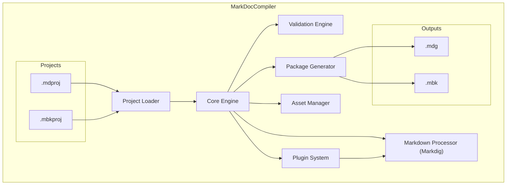

# MarkDocCompiler Architecture

MarkDocCompiler is a headless, modular build engine responsible for transforming structured Markdown-based project files into portable documentation packages. It is designed for integration with MarkDocEditor, CI/CD pipelines, and future API-based automation.

---

## Component Overview

---

## Core Components

### Core Engine

Coordinates the overall compilation lifecycle and task execution order.

### Project Loader

Parses `.mdproj` and `.mbkproj` files into structured, memory-resident build graphs.

### Validation Engine

Executes rule-based checks on structure, metadata, accessibility, and syntax.

### Markdown Processor

Uses Markdig to parse Markdown into AST form, apply transformations, and emit HTML.

### Plugin System

Dynamically loads and runs C# plugins that operate on AST nodes or metadata.

### Asset Manager

Handles external images, audio, video, and static content. Optimizes assets and resolves paths.

### Package Generator

Assembles and serializes final output into either `.mdg` or `.mbk` packages.

---

## External Interfaces

* **MarkDocEditor**: Primary caller for interactive builds
* **CLI**: Headless execution mode for batch builds and automation
* **(Planned)**: Public API interface for dynamic invocation

---

This architecture enables decoupled, reusable compilation logic across multiple delivery contexts within MarkDocSuite.
