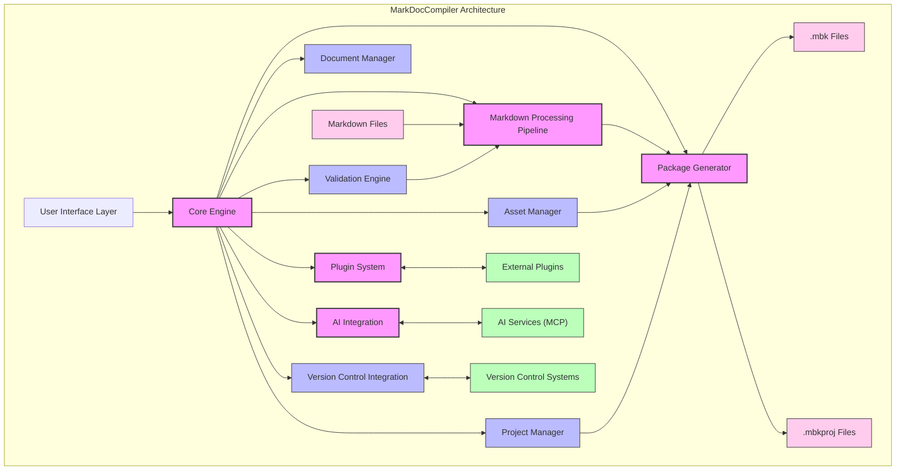
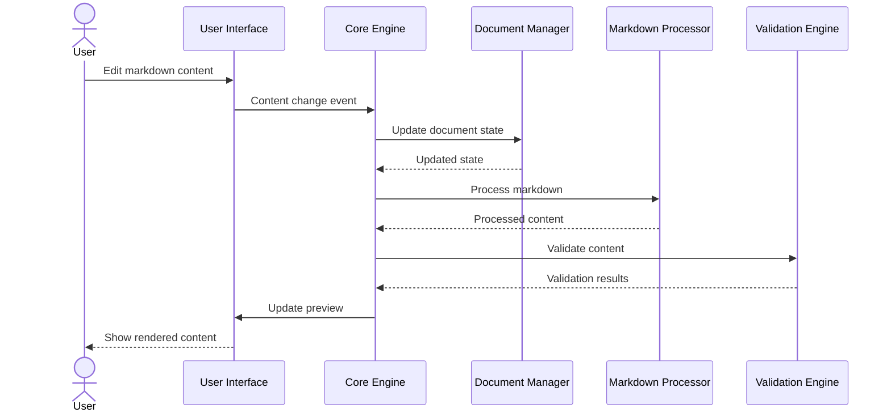
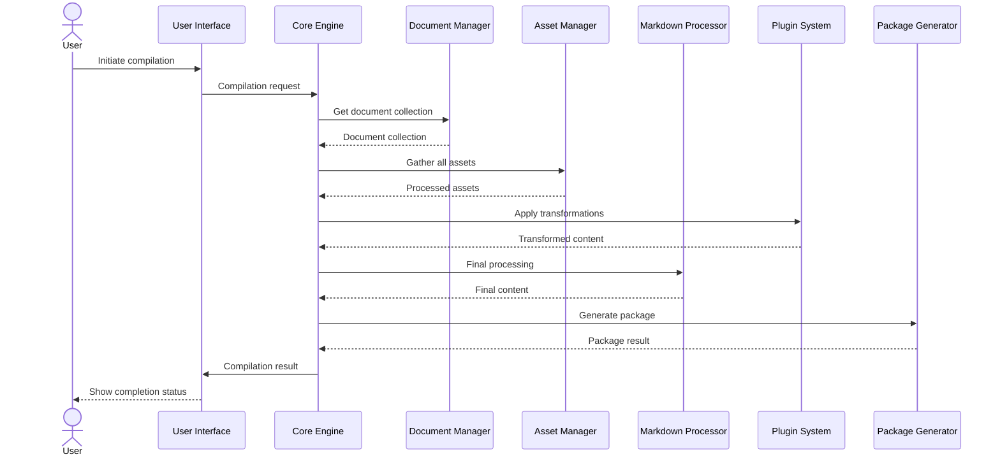

# MarkDocCompiler Architecture

## Architectural Overview

MarkDocCompiler follows a modular architecture designed for extensibility, maintainability, and performance. The system is structured around a central core engine that orchestrates the workflow between specialized components, each with a clearly defined responsibility.

## Core Components

### Core Engine

The Core Engine serves as the central coordinator for all compiler operations:

- **Workflow Management**: Orchestrates the flow between components
- **State Management**: Maintains application and document state
- **Event System**: Provides pub/sub mechanism for component communication
- **Configuration**: Manages application and project settings
- **Error Handling**: Centralizes error management and reporting

### User Interface Layer

The UI Layer provides the interactive environment for users:

- **Editor Component**: WYSIWYG markdown editing experience
- **Preview Renderer**: Real-time visualization of content
- **Project Explorer**: Navigation and organization interface
- **Configuration Interface**: Settings and preferences UI
- **Notification System**: User feedback and alerts

### Markdown Processing Pipeline

The Processing Pipeline handles content transformation:

- **Parser**: Converts markdown text to Abstract Syntax Tree (AST)
- **AST Transformers**: Apply modifications to the content structure
- **Extension Handlers**: Process custom markdown syntax
- **Optimization Stage**: Prepare content for efficient rendering
- **Output Generation**: Create final processed content

### Package Generator

The Package Generator creates distributable documentation packages:

- **Content Bundling**: Combines all necessary content
- **Asset Processing**: Optimizes and includes media and resources
- **Metadata Creation**: Generates package metadata
- **Compression**: Optimizes package size
- **Format Implementation**: Creates .mbk and .mbkproj files

### Plugin System

The Plugin System enables extensibility:

- **Plugin Loading**: Discovers and initializes plugins
- **Interface Implementation**: Connects plugins to extension points
- **Lifecycle Management**: Handles plugin activation/deactivation
- **Configuration**: Manages plugin settings
- **Sandboxing**: Ensures plugin security and stability

### AI Integration

The AI Integration component connects to AI services:

- **MCP Protocol Implementation**: Standardized communication
- **Request Formation**: Creates appropriate prompts
- **Response Processing**: Handles AI-generated content
- **Authentication**: Manages API keys and access
- **Context Management**: Provides appropriate context to AI services

## Supporting Components

### Document Manager

The Document Manager handles content organization:

- **File Management**: Opens, saves, and tracks documents
- **Structure Management**: Maintains document hierarchy
- **History Tracking**: Manages document versions and changes
- **Import/Export**: Handles conversions from other formats
- **Backup**: Ensures content preservation

### Asset Manager

The Asset Manager handles non-markdown resources:

- **Image Processing**: Optimization and format conversion
- **Media Management**: Handles video, audio, and other media
- **Resource Tracking**: Maintains references to external resources
- **Dependency Resolution**: Ensures all required assets are included
- **Optimization**: Reduces asset sizes for efficient packaging

### Validation Engine

The Validation Engine performs quality checks:

- **Link Validation**: Verifies internal and external links
- **Structure Validation**: Checks document organization
- **Content Quality**: Spelling, grammar, and style checks
- **Accessibility Validation**: Checks for accessibility issues
- **Standard Compliance**: Ensures adherence to documentation standards

### Project Manager

The Project Manager handles collections of documents:

- **Project Structure**: Maintains project organization
- **Build Configuration**: Manages compilation settings
- **Dependency Tracking**: Handles relationships between documents
- **Batch Operations**: Performs actions across multiple documents
- **Project Templates**: Provides starting points for common project types

### Version Control Integration

The VCS Integration connects with source control systems:

- **Repository Interaction**: Commit, push, pull operations
- **Change Tracking**: Visualizes document changes
- **Branch Management**: Handles different content versions
- **Conflict Resolution**: Assists with merging content
- **History Visualization**: Shows document evolution

## Data Flow

### Editing Workflow

### Compilation Workflow

## Extension Points

MarkDocCompiler provides several extension points for plugins:

1. **Markdown Extensions**: Add custom markdown syntax
2. **Content Transformers**: Modify content during processing
3. **Validation Rules**: Add custom validation checks
4. **Export Formats**: Create additional output formats
5. **UI Components**: Add custom interface elements
6. **Tool Integrations**: Connect with external tools and services

## Technical Architecture

### Language and Framework

MarkDocCompiler is built with Electron and TypeScript:

- **Electron**: Provides cross-platform desktop capabilities
- **TypeScript**: Ensures type safety and maintainability
- **React**: Powers the user interface components
- **Node.js**: Enables file system and process management

### Pattern and Design Principles

The architecture follows several key design patterns:

- **Model-View-Controller (MVC)**: Separates concerns in the UI layer
- **Dependency Injection**: Loose coupling between components
- **Observer Pattern**: Event-based communication
- **Factory Pattern**: Dynamic creation of specialized components
- **Strategy Pattern**: Pluggable algorithms for different tasks

### Performance Considerations

Several strategies ensure optimal performance:

- **Incremental Processing**: Only changed content is reprocessed
- **Worker Threads**: Offload intensive processing to background threads
- **Lazy Loading**: Components and resources loaded on demand
- **Caching**: Strategic caching of processed content
- **Memory Management**: Careful handling of large documents

## Security Architecture

Security is built into the design:

- **Plugin Sandboxing**: Isolation of third-party code
- **Input Validation**: All external content is validated
- **Content Isolation**: Strict separation between content and code
- **Permission Model**: Explicit user permissions for sensitive operations
- **Update Security**: Secure mechanism for software updates

## Scalability

The architecture supports scaling in several dimensions:

- **Document Size**: Efficient handling of large documents
- **Project Complexity**: Support for complex documentation structures
- **Plugin Ecosystem**: Infrastructure for many plugins
- **Team Collaboration**: Multi-user workflow capabilities
- **Enterprise Integration**: Connectivity with organizational systems

## Deployment Architecture

MarkDocCompiler can be deployed in several configurations:

- **Standalone Application**: Traditional desktop application
- **Network Configuration**: Shared settings and resources
- **Enterprise Deployment**: Centralized management and distribution
- **CI/CD Integration**: Automated documentation builds

## Future Extensibility

The architecture allows for future expansion in several areas:

1. **Collaboration Features**: Real-time multi-user editing
2. **Cloud Integration**: Synchronization and remote storage
3. **Advanced AI Capabilities**: More sophisticated content assistance
4. **Mobile Companion**: Remote control and viewing
5. **Enterprise Features**: Advanced security and compliance

This modular architecture ensures that MarkDocCompiler can evolve to meet future documentation needs while maintaining its core strengths in simplicity, performance, and flexibility.
