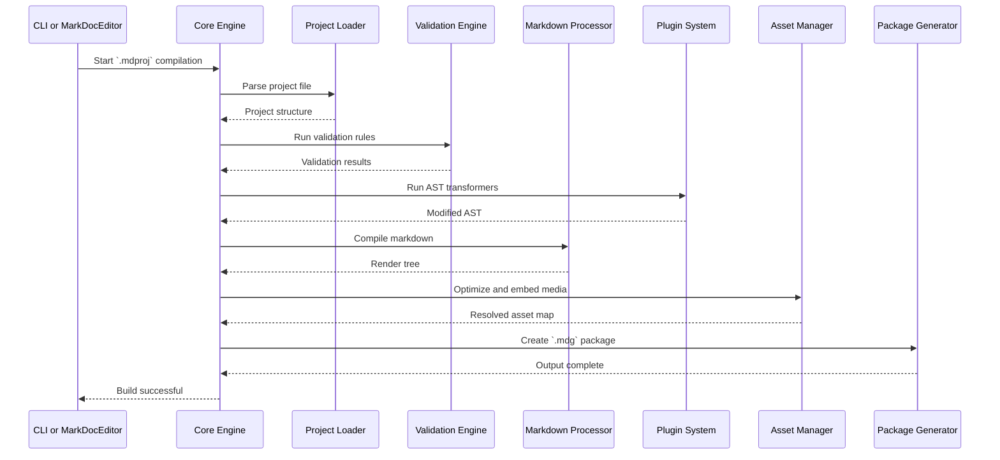
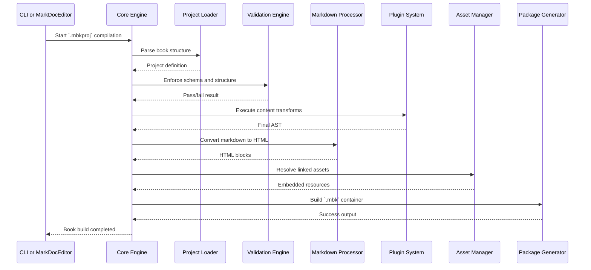
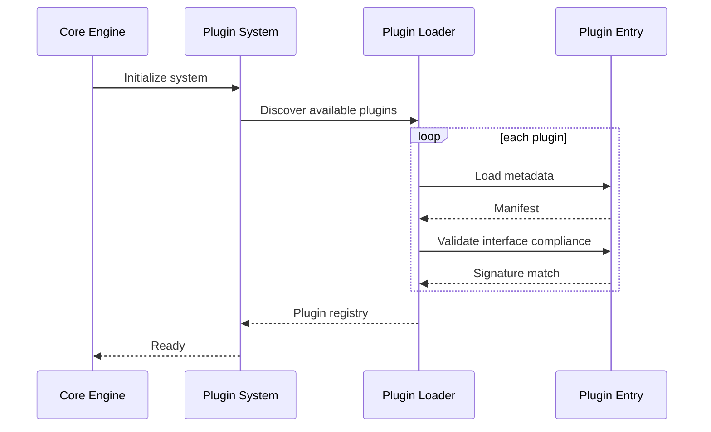

# MarkDocCompiler Process and Sequence Flows

This document outlines the core execution flows for the MarkDocCompiler system. These flows represent internal logic only and do not include UI interactions. All sequences are applicable in both CLI and programmatic invocation contexts.

---

## 1. Compilation from `.mdproj` to `.mdg`

---

## 2. Compilation from `.mbkproj` to `.mbk`

---

## 3. Plugin Load and Validation Flow

---

These flows describe the complete process from input project to output package using the MarkDocCompiler execution model.
