# MarkDocCompiler Process and Sequence Flows

This document outlines the key process and sequence flows within the MarkDocCompiler application, illustrating how different components interact to accomplish core tasks.

## Document Creation and Editing Flow

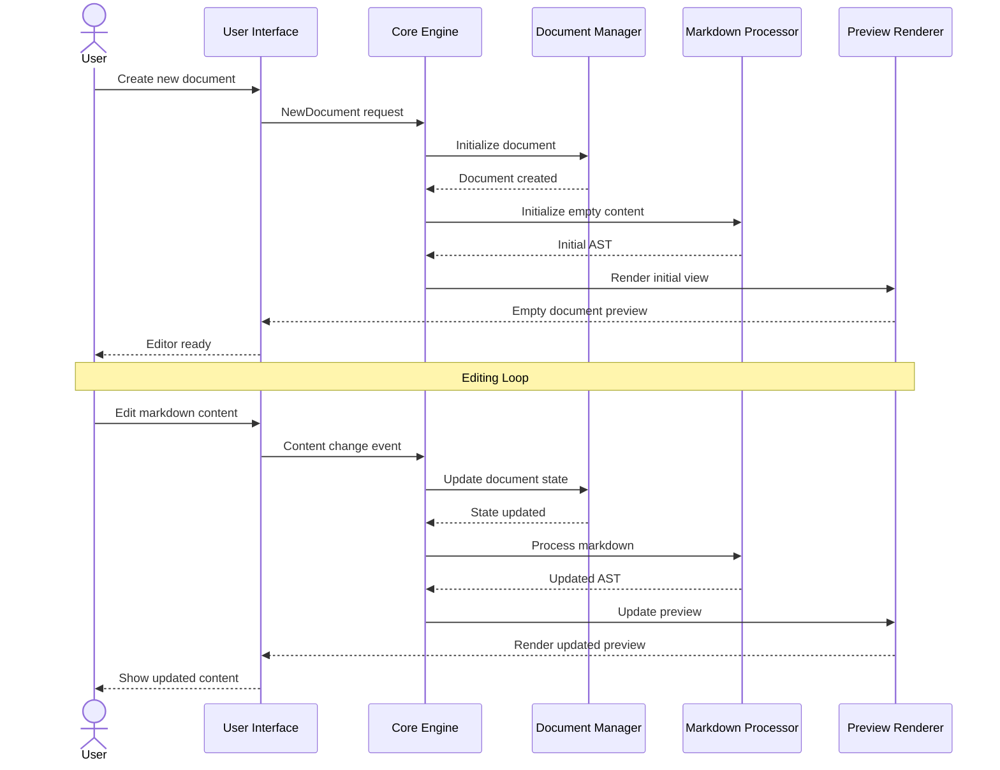
```mermaid
sequenceDiagram
    actor User
    participant UI as User Interface
    participant Core as Core Engine
    participant DM as Document Manager
    participant MP as Markdown Processor
    participant Preview as Preview Renderer
    
    User->>UI: Create new document
    UI->>Core: NewDocument request
    Core->>DM: Initialize document
    DM-->>Core: Document created
    Core->>MP: Initialize empty content
    MP-->>Core: Initial AST
    Core->>Preview: Render initial view
    Preview-->>UI: Empty document preview
    UI-->>User: Editor ready
    
    Note over User, Preview: Editing Loop
    
    User->>UI: Edit markdown content
    UI->>Core: Content change event
    Core->>DM: Update document state
    DM-->>Core: State updated
    Core->>MP: Process markdown
    MP-->>Core: Updated AST
    Core->>Preview: Update preview
    Preview-->>UI: Render updated preview
    UI-->>User: Show updated content
```

## Document Compilation Flow

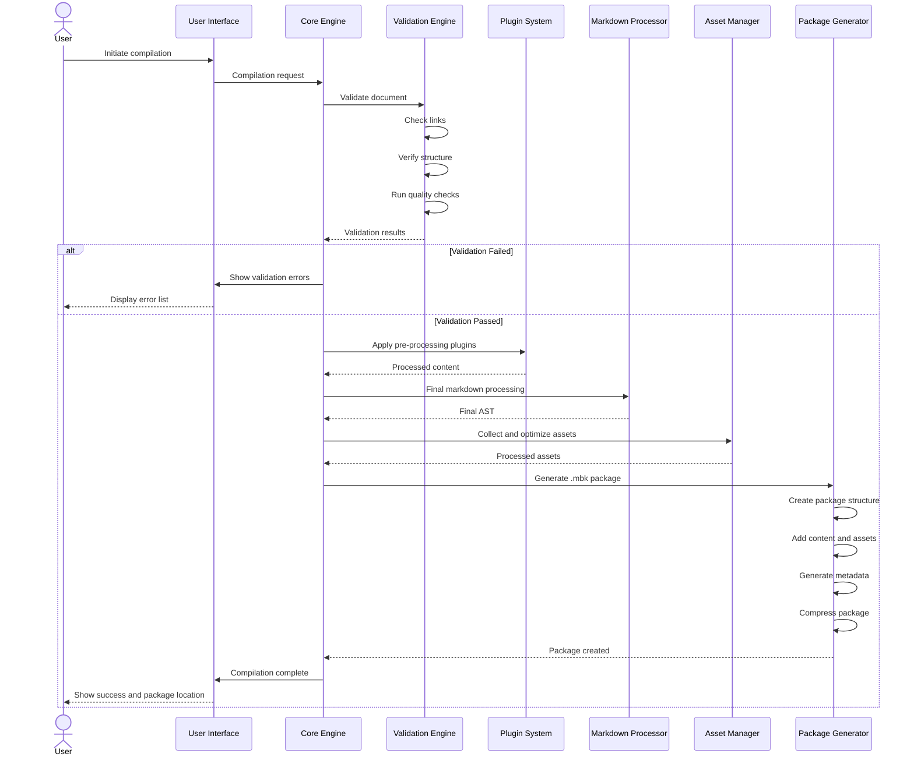
```mermaid
sequenceDiagram
    actor User
    participant UI as User Interface
    participant Core as Core Engine
    participant Validator as Validation Engine
    participant Plugin as Plugin System
    participant MP as Markdown Processor
    participant AM as Asset Manager
    participant PG as Package Generator
    
    User->>UI: Initiate compilation
    UI->>Core: Compilation request
    
    Core->>Validator: Validate document
    Validator->>Validator: Check links
    Validator->>Validator: Verify structure
    Validator->>Validator: Run quality checks
    Validator-->>Core: Validation results
    
    alt Validation Failed
        Core->>UI: Show validation errors
        UI-->>User: Display error list
    else Validation Passed
        Core->>Plugin: Apply pre-processing plugins
        Plugin-->>Core: Processed content
        
        Core->>MP: Final markdown processing
        MP-->>Core: Final AST
        
        Core->>AM: Collect and optimize assets
        AM-->>Core: Processed assets
        
        Core->>PG: Generate .mbk package
        PG->>PG: Create package structure
        PG->>PG: Add content and assets
        PG->>PG: Generate metadata
        PG->>PG: Compress package
        PG-->>Core: Package created
        
        Core->>UI: Compilation complete
        UI-->>User: Show success and package location
    end
```

## Project Creation Flow

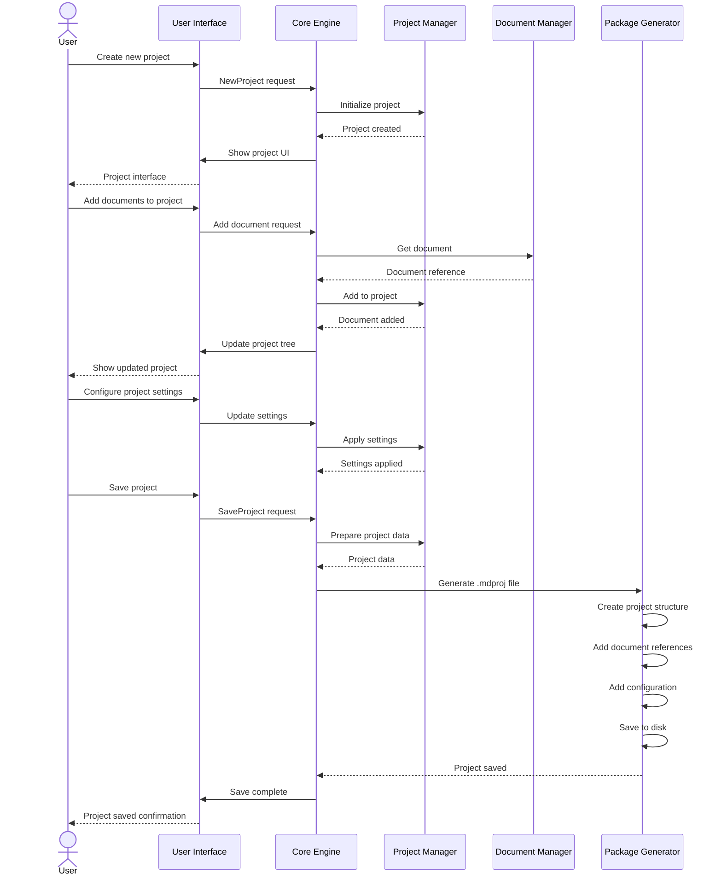
```mermaid
sequenceDiagram
    actor User
    participant UI as User Interface
    participant Core as Core Engine
    participant PM as Project Manager
    participant DM as Document Manager
    participant PG as Package Generator
    
    User->>UI: Create new project
    UI->>Core: NewProject request
    Core->>PM: Initialize project
    PM-->>Core: Project created
    Core->>UI: Show project UI
    UI-->>User: Project interface
    
    User->>UI: Add documents to project
    UI->>Core: Add document request
    Core->>DM: Get document
    DM-->>Core: Document reference
    Core->>PM: Add to project
    PM-->>Core: Document added
    Core->>UI: Update project tree
    UI-->>User: Show updated project
    
    User->>UI: Configure project settings
    UI->>Core: Update settings
    Core->>PM: Apply settings
    PM-->>Core: Settings applied
    
    User->>UI: Save project
    UI->>Core: SaveProject request
    Core->>PM: Prepare project data
    PM-->>Core: Project data
    Core->>PG: Generate .mdproj file
    PG->>PG: Create project structure
    PG->>PG: Add document references
    PG->>PG: Add configuration
    PG->>PG: Save to disk
    PG-->>Core: Project saved
    Core->>UI: Save complete
    UI-->>User: Project saved confirmation
```

## AI Integration Flow

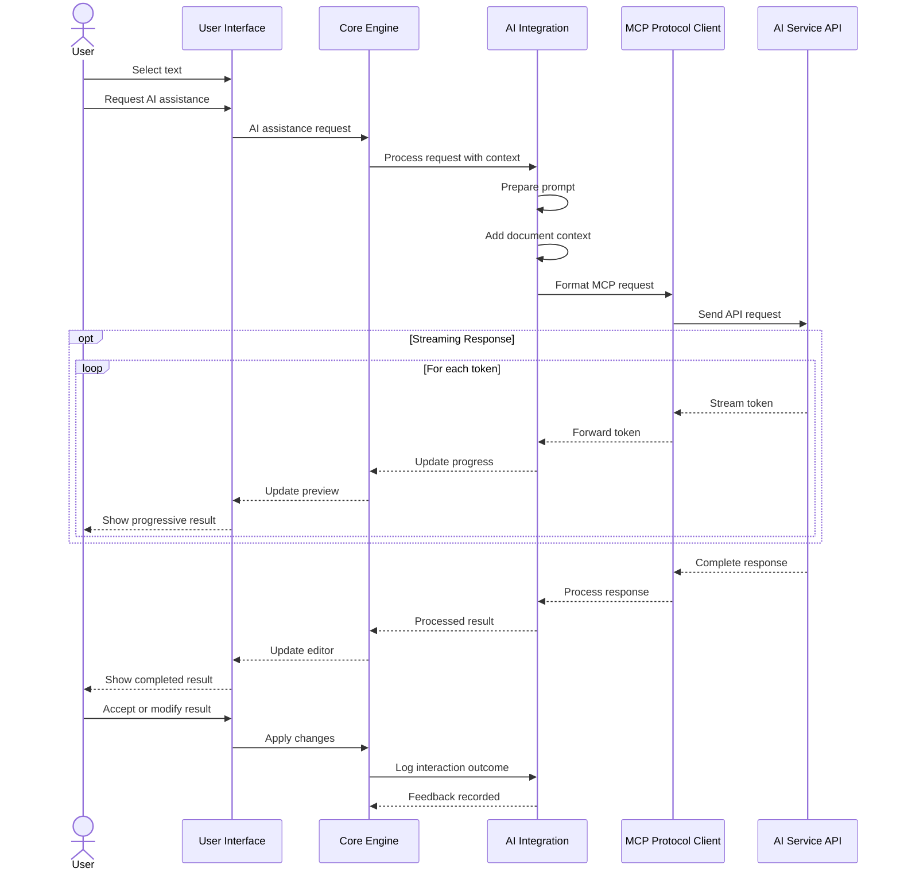
```mermaid
sequenceDiagram
    actor User
    participant UI as User Interface
    participant Core as Core Engine
    participant AI as AI Integration
    participant MCP as MCP Protocol Client
    participant API as AI Service API
    
    User->>UI: Select text
    User->>UI: Request AI assistance
    UI->>Core: AI assistance request
    Core->>AI: Process request with context
    
    AI->>AI: Prepare prompt
    AI->>AI: Add document context
    
    AI->>MCP: Format MCP request
    MCP->>API: Send API request
    
    opt Streaming Response
        loop For each token
            API-->>MCP: Stream token
            MCP-->>AI: Forward token
            AI-->>Core: Update progress
            Core-->>UI: Update preview
            UI-->>User: Show progressive result
        end
    end
    
    API-->>MCP: Complete response
    MCP-->>AI: Process response
    AI-->>Core: Processed result
    Core-->>UI: Update editor
    UI-->>User: Show completed result
    
    User->>UI: Accept or modify result
    UI->>Core: Apply changes
    Core->>AI: Log interaction outcome
    AI-->>Core: Feedback recorded
```

## Plugin Loading Flow

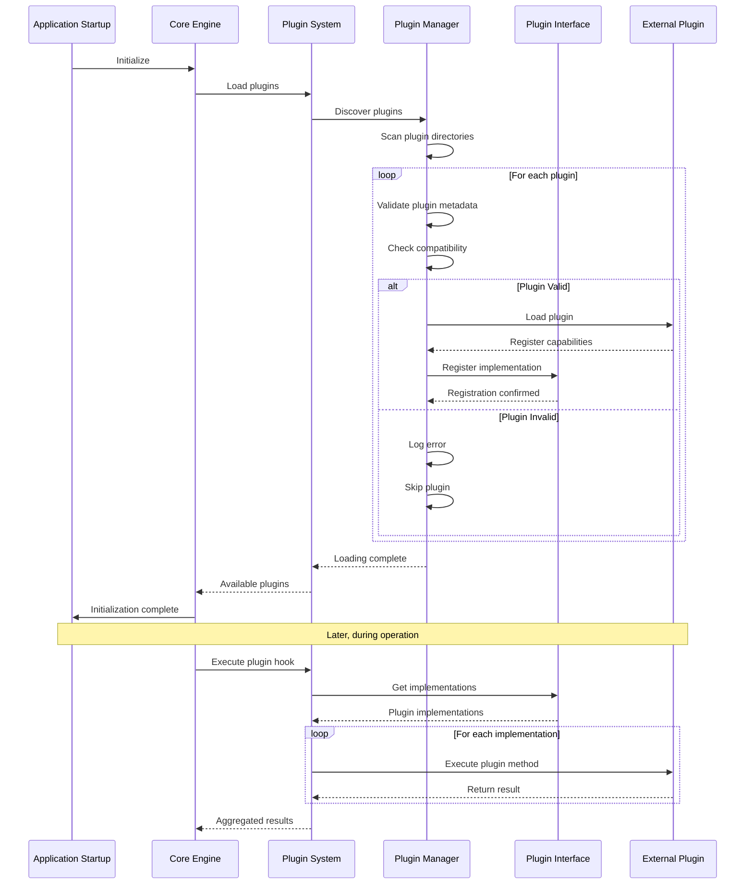
```mermaid
sequenceDiagram
    participant App as Application Startup
    participant Core as Core Engine
    participant PS as Plugin System
    participant PM as Plugin Manager
    participant PI as Plugin Interface
    participant EP as External Plugin
    
    App->>Core: Initialize
    Core->>PS: Load plugins
    
    PS->>PM: Discover plugins
    PM->>PM: Scan plugin directories
    
    loop For each plugin
        PM->>PM: Validate plugin metadata
        PM->>PM: Check compatibility
        
        alt Plugin Valid
            PM->>EP: Load plugin
            EP-->>PM: Register capabilities
            PM->>PI: Register implementation
            PI-->>PM: Registration confirmed
        else Plugin Invalid
            PM->>PM: Log error
            PM->>PM: Skip plugin
        end
    end
    
    PM-->>PS: Loading complete
    PS-->>Core: Available plugins
    Core->>App: Initialization complete
    
    Note over App, EP: Later, during operation
    
    Core->>PS: Execute plugin hook
    PS->>PI: Get implementations
    PI-->>PS: Plugin implementations
    
    loop For each implementation
        PS->>EP: Execute plugin method
        EP-->>PS: Return result
    end
    
    PS-->>Core: Aggregated results
```

## Validation Process Flow

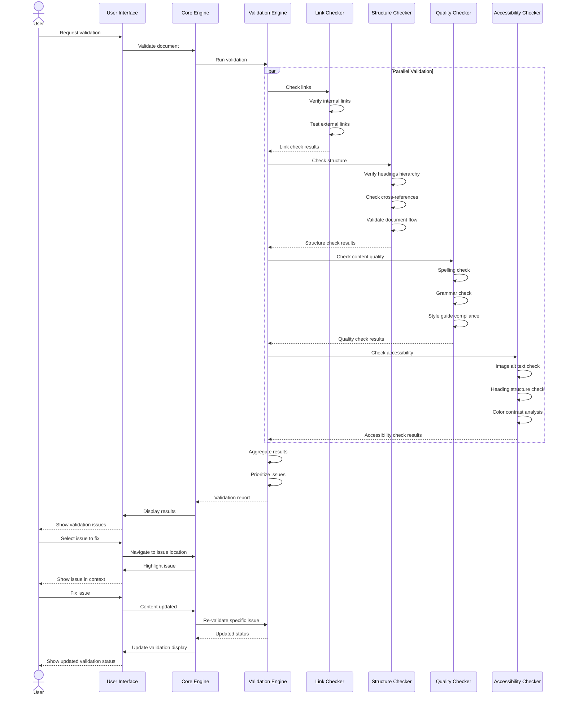
```mermaid
sequenceDiagram
    actor User
    participant UI as User Interface
    participant Core as Core Engine
    participant Val as Validation Engine
    participant LC as Link Checker
    participant SC as Structure Checker
    participant QC as Quality Checker
    participant AC as Accessibility Checker
    
    User->>UI: Request validation
    UI->>Core: Validate document
    Core->>Val: Run validation
    
    par Parallel Validation
        Val->>LC: Check links
        LC->>LC: Verify internal links
        LC->>LC: Test external links
        LC-->>Val: Link check results
        
        Val->>SC: Check structure
        SC->>SC: Verify headings hierarchy
        SC->>SC: Check cross-references
        SC->>SC: Validate document flow
        SC-->>Val: Structure check results
        
        Val->>QC: Check content quality
        QC->>QC: Spelling check
        QC->>QC: Grammar check
        QC->>QC: Style guide compliance
        QC-->>Val: Quality check results
        
        Val->>AC: Check accessibility
        AC->>AC: Image alt text check
        AC->>AC: Heading structure check
        AC->>AC: Color contrast analysis
        AC-->>Val: Accessibility check results
    end
    
    Val->>Val: Aggregate results
    Val->>Val: Prioritize issues
    Val-->>Core: Validation report
    
    Core->>UI: Display results
    UI-->>User: Show validation issues
    
    User->>UI: Select issue to fix
    UI->>Core: Navigate to issue location
    Core->>UI: Highlight issue
    UI-->>User: Show issue in context
    
    User->>UI: Fix issue
    UI->>Core: Content updated
    Core->>Val: Re-validate specific issue
    Val-->>Core: Updated status
    Core->>UI: Update validation display
    UI-->>User: Show updated validation status
```

## Asset Management Flow

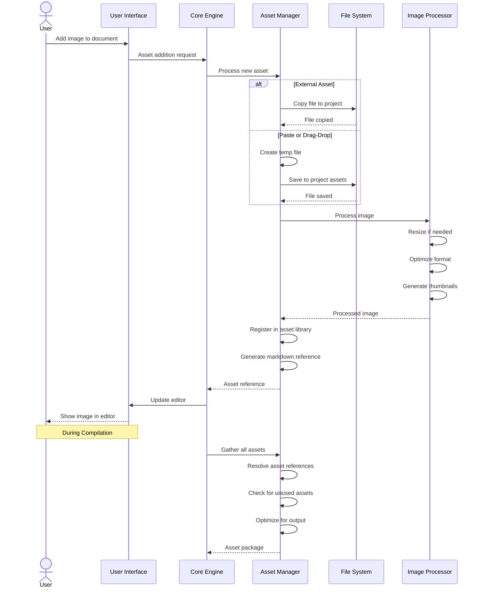
```mermaid
sequenceDiagram
    actor User
    participant UI as User Interface
    participant Core as Core Engine
    participant AM as Asset Manager
    participant FS as File System
    participant IM as Image Processor
    
    User->>UI: Add image to document
    UI->>Core: Asset addition request
    Core->>AM: Process new asset
    
    alt External Asset
        AM->>FS: Copy file to project
        FS-->>AM: File copied
    else Paste or Drag-Drop
        AM->>AM: Create temp file
        AM->>FS: Save to project assets
        FS-->>AM: File saved
    end
    
    AM->>IM: Process image
    IM->>IM: Resize if needed
    IM->>IM: Optimize format
    IM->>IM: Generate thumbnails
    IM-->>AM: Processed image
    
    AM->>AM: Register in asset library
    AM->>AM: Generate markdown reference
    AM-->>Core: Asset reference
    
    Core->>UI: Update editor
    UI-->>User: Show image in editor
    
    Note over User, UI: During Compilation
    
    Core->>AM: Gather all assets
    AM->>AM: Resolve asset references
    AM->>AM: Check for unused assets
    AM->>AM: Optimize for output
    AM-->>Core: Asset package
```

## Document Import Flow

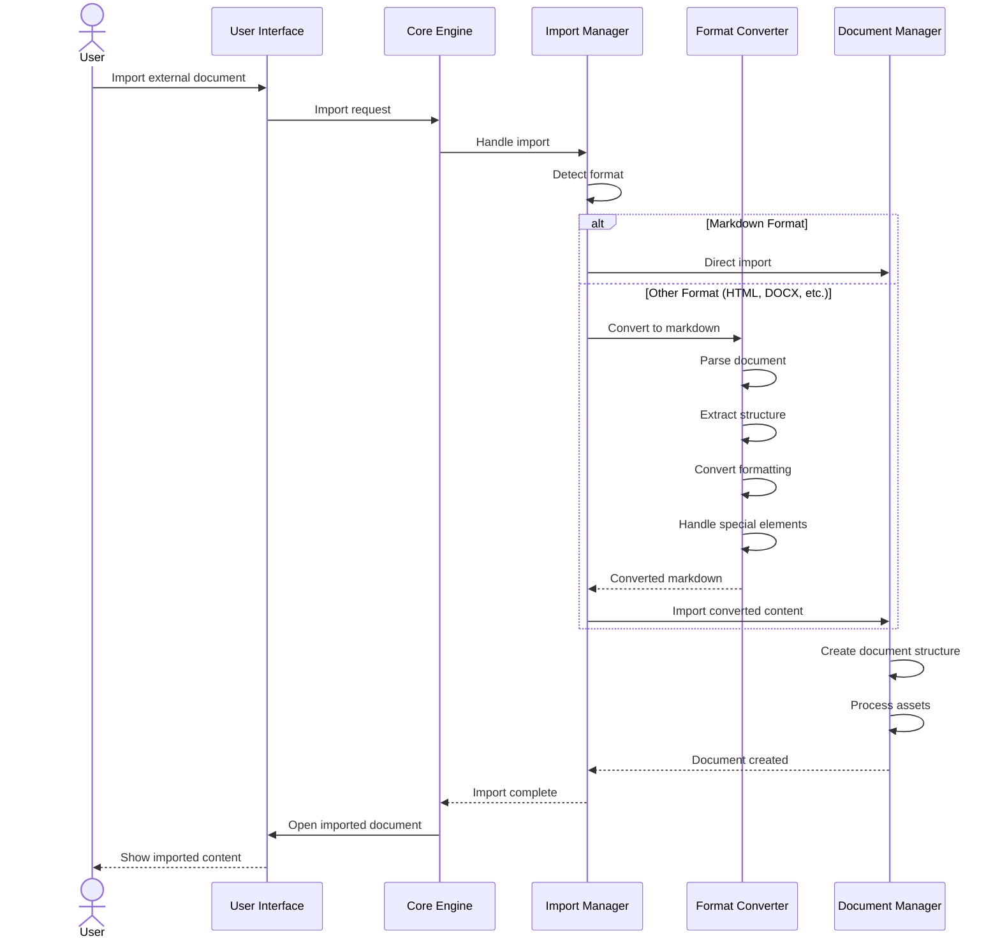
```mermaid
sequenceDiagram
    actor User
    participant UI as User Interface
    participant Core as Core Engine
    participant IMP as Import Manager
    participant CONV as Format Converter
    participant DM as Document Manager
    
    User->>UI: Import external document
    UI->>Core: Import request
    Core->>IMP: Handle import
    
    IMP->>IMP: Detect format
    
    alt Markdown Format
        IMP->>DM: Direct import
    else Other Format (HTML, DOCX, etc.)
        IMP->>CONV: Convert to markdown
        CONV->>CONV: Parse document
        CONV->>CONV: Extract structure
        CONV->>CONV: Convert formatting
        CONV->>CONV: Handle special elements
        CONV-->>IMP: Converted markdown
        IMP->>DM: Import converted content
    end
    
    DM->>DM: Create document structure
    DM->>DM: Process assets
    DM-->>IMP: Document created
    
    IMP-->>Core: Import complete
    Core->>UI: Open imported document
    UI-->>User: Show imported content
```

## Project Build Process

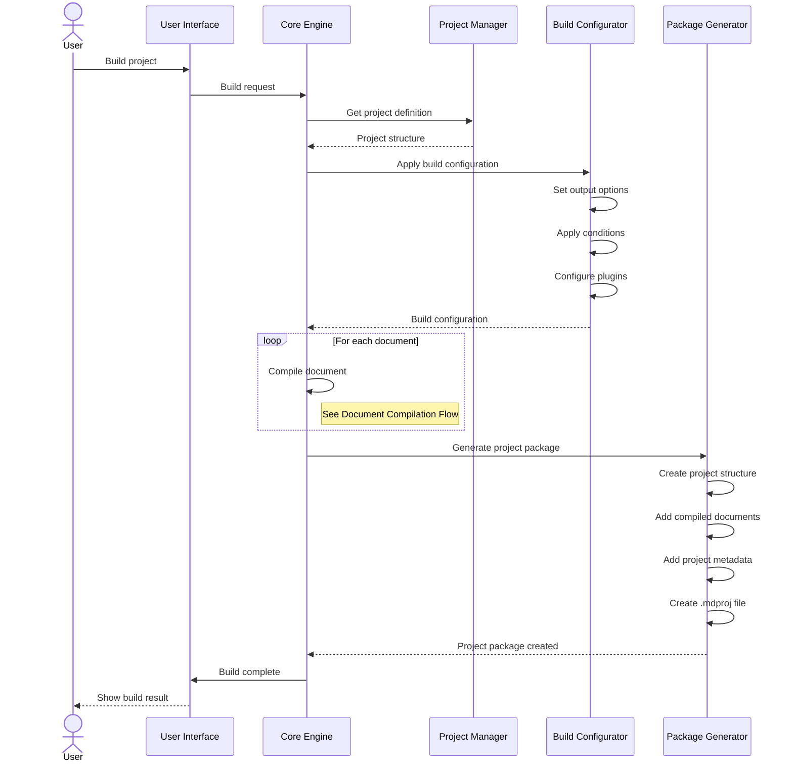
```mermaid
sequenceDiagram
    actor User
    participant UI as User Interface
    participant Core as Core Engine
    participant PM as Project Manager
    participant BC as Build Configurator
    participant PG as Package Generator
    
    User->>UI: Build project
    UI->>Core: Build request
    Core->>PM: Get project definition
    PM-->>Core: Project structure
    
    Core->>BC: Apply build configuration
    BC->>BC: Set output options
    BC->>BC: Apply conditions
    BC->>BC: Configure plugins
    BC-->>Core: Build configuration
    
    loop For each document
        Core->>Core: Compile document
        Note right of Core: See Document Compilation Flow
    end
    
    Core->>PG: Generate project package
    PG->>PG: Create project structure
    PG->>PG: Add compiled documents
    PG->>PG: Add project metadata
    PG->>PG: Create .mdproj file
    PG-->>Core: Project package created
    
    Core->>UI: Build complete
    UI-->>User: Show build result
```

## Version Control Integration

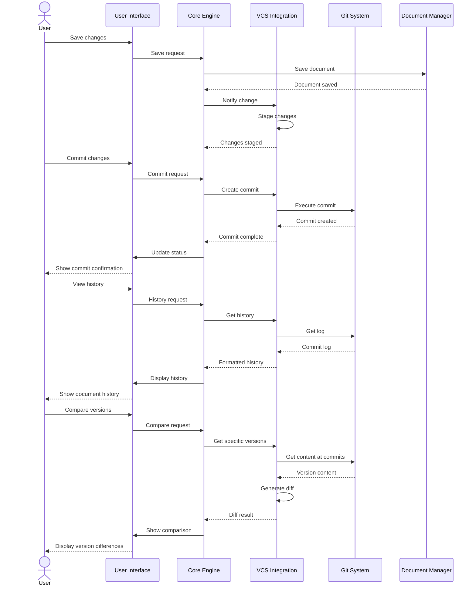
```mermaid
sequenceDiagram
    actor User
    participant UI as User Interface
    participant Core as Core Engine
    participant VCS as VCS Integration
    participant Git as Git System
    participant DM as Document Manager
    
    User->>UI: Save changes
    UI->>Core: Save request
    Core->>DM: Save document
    DM-->>Core: Document saved
    Core->>VCS: Notify change
    VCS->>VCS: Stage changes
    VCS-->>Core: Changes staged
    
    User->>UI: Commit changes
    UI->>Core: Commit request
    Core->>VCS: Create commit
    VCS->>Git: Execute commit
    Git-->>VCS: Commit created
    VCS-->>Core: Commit complete
    Core->>UI: Update status
    UI-->>User: Show commit confirmation
    
    User->>UI: View history
    UI->>Core: History request
    Core->>VCS: Get history
    VCS->>Git: Get log
    Git-->>VCS: Commit log
    VCS-->>Core: Formatted history
    Core->>UI: Display history
    UI-->>User: Show document history
    
    User->>UI: Compare versions
    UI->>Core: Compare request
    Core->>VCS: Get specific versions
    VCS->>Git: Get content at commits
    Git-->>VCS: Version content
    VCS->>VCS: Generate diff
    VCS-->>Core: Diff result
    Core->>UI: Show comparison
    UI-->>User: Display version differences
```

## Template Usage Flow

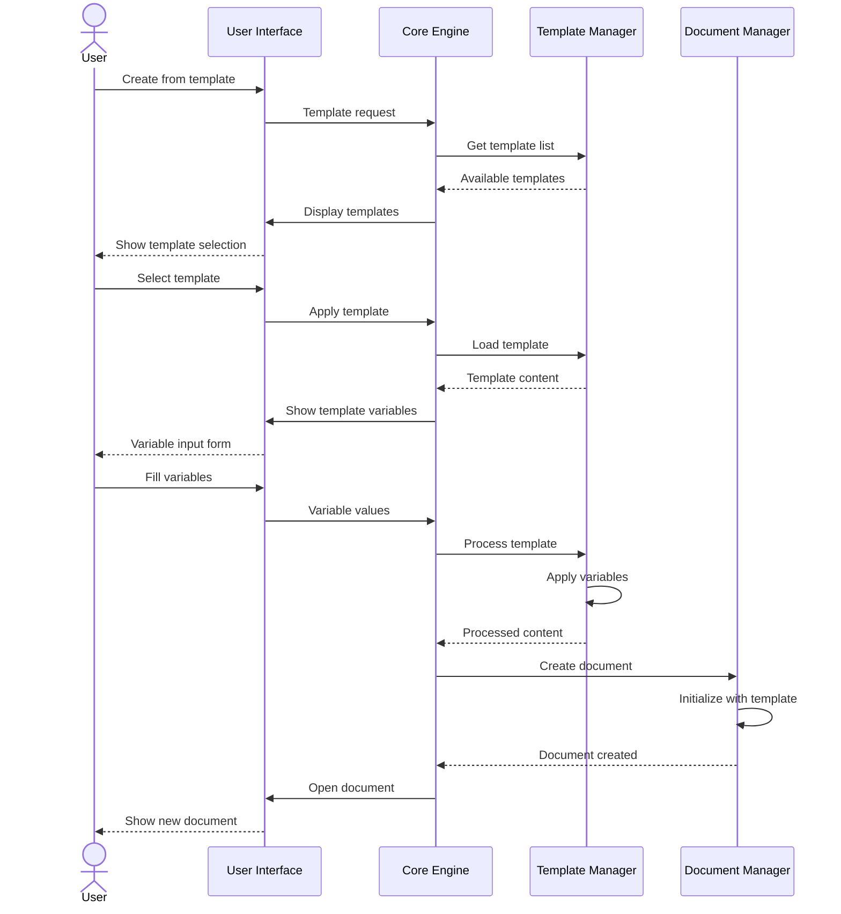
```mermaid
sequenceDiagram
    actor User
    participant UI as User Interface
    participant Core as Core Engine
    participant TM as Template Manager
    participant DM as Document Manager
    
    User->>UI: Create from template
    UI->>Core: Template request
    Core->>TM: Get template list
    TM-->>Core: Available templates
    Core->>UI: Display templates
    UI-->>User: Show template selection
    
    User->>UI: Select template
    UI->>Core: Apply template
    Core->>TM: Load template
    TM-->>Core: Template content
    
    Core->>UI: Show template variables
    UI-->>User: Variable input form
    User->>UI: Fill variables
    UI->>Core: Variable values
    
    Core->>TM: Process template
    TM->>TM: Apply variables
    TM-->>Core: Processed content
    
    Core->>DM: Create document
    DM->>DM: Initialize with template
    DM-->>Core: Document created
    Core->>UI: Open document
    UI-->>User: Show new document
```

## Search and Navigation Flow

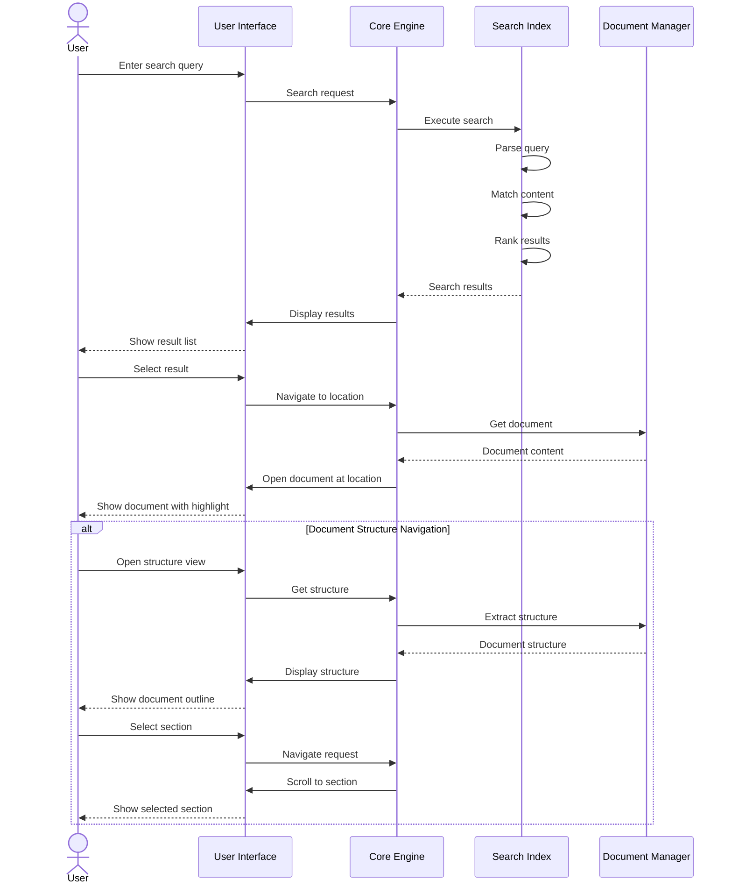
```mermaid
sequenceDiagram
    actor User
    participant UI as User Interface
    participant Core as Core Engine
    participant SI as Search Index
    participant DM as Document Manager
    
    User->>UI: Enter search query
    UI->>Core: Search request
    Core->>SI: Execute search
    SI->>SI: Parse query
    SI->>SI: Match content
    SI->>SI: Rank results
    SI-->>Core: Search results
    Core->>UI: Display results
    UI-->>User: Show result list
    
    User->>UI: Select result
    UI->>Core: Navigate to location
    Core->>DM: Get document
    DM-->>Core: Document content
    Core->>UI: Open document at location
    UI-->>User: Show document with highlight
    
    alt Document Structure Navigation
        User->>UI: Open structure view
        UI->>Core: Get structure
        Core->>DM: Extract structure
        DM-->>Core: Document structure
        Core->>UI: Display structure
        UI-->>User: Show document outline
        
        User->>UI: Select section
        UI->>Core: Navigate request
        Core->>UI: Scroll to section
        UI-->>User: Show selected section
    end
```

## Settings and Preferences Flow

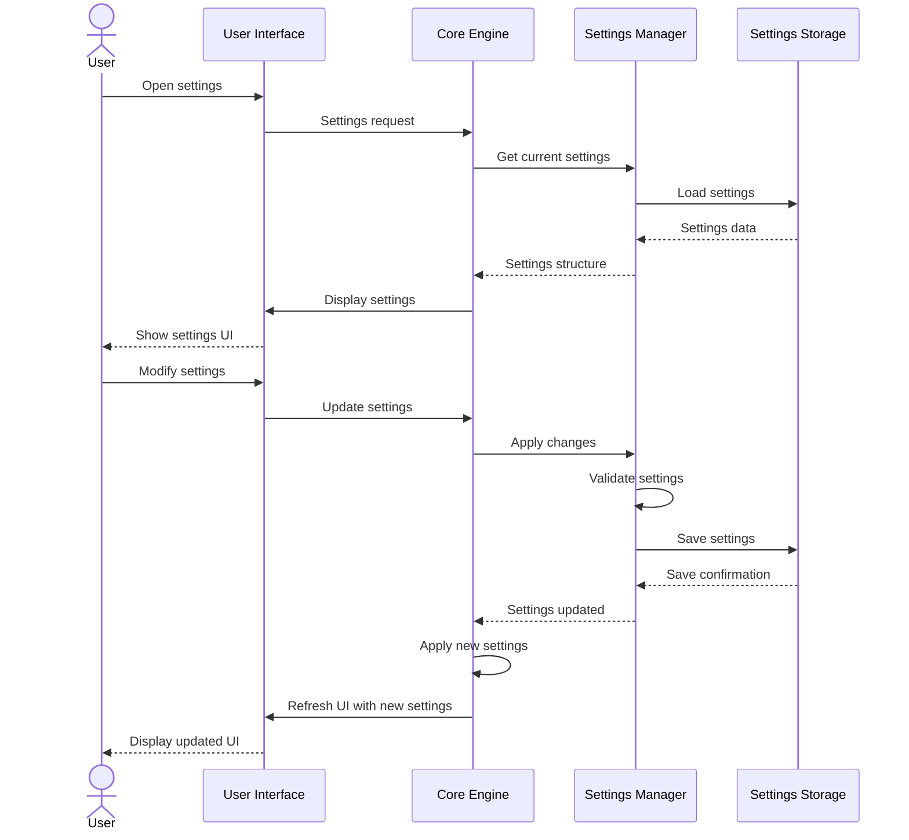
```mermaid
sequenceDiagram
    actor User
    participant UI as User Interface
    participant Core as Core Engine
    participant SM as Settings Manager
    participant ST as Settings Storage
    
    User->>UI: Open settings
    UI->>Core: Settings request
    Core->>SM: Get current settings
    SM->>ST: Load settings
    ST-->>SM: Settings data
    SM-->>Core: Settings structure
    Core->>UI: Display settings
    UI-->>User: Show settings UI
    
    User->>UI: Modify settings
    UI->>Core: Update settings
    Core->>SM: Apply changes
    SM->>SM: Validate settings
    SM->>ST: Save settings
    ST-->>SM: Save confirmation
    SM-->>Core: Settings updated
    Core->>Core: Apply new settings
    Core->>UI: Refresh UI with new settings
    UI-->>User: Display updated UI
```

## Export to Alternative Format Flow

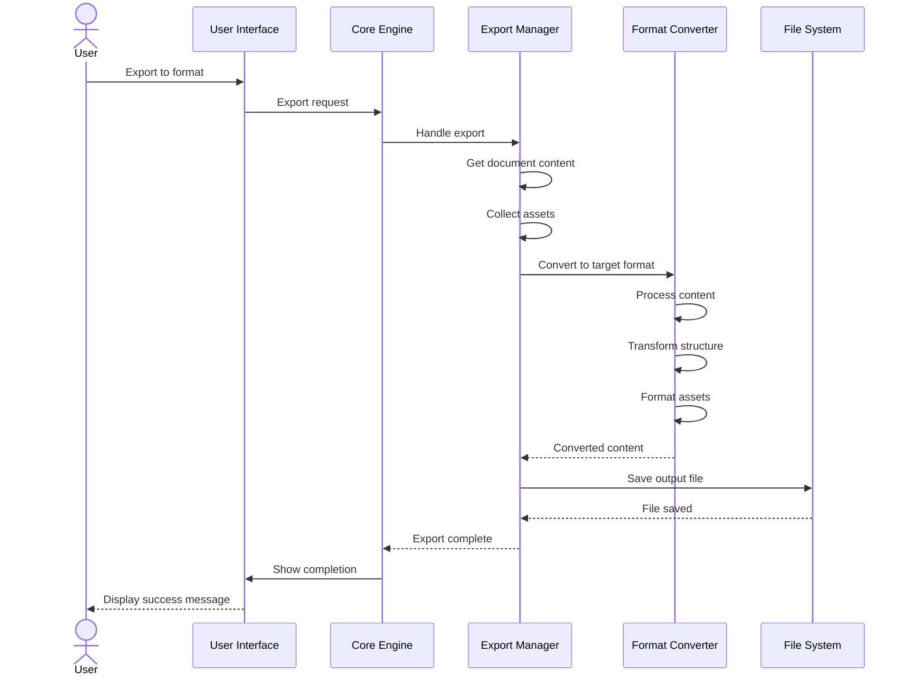
```mermaid
sequenceDiagram
    actor User
    participant UI as User Interface
    participant Core as Core Engine
    participant EXP as Export Manager
    participant CONV as Format Converter
    participant FS as File System
    
    User->>UI: Export to format
    UI->>Core: Export request
    Core->>EXP: Handle export
    
    EXP->>EXP: Get document content
    EXP->>EXP: Collect assets
    
    EXP->>CONV: Convert to target format
    CONV->>CONV: Process content
    CONV->>CONV: Transform structure
    CONV->>CONV: Format assets
    CONV-->>EXP: Converted content
    
    EXP->>FS: Save output file
    FS-->>EXP: File saved
    
    EXP-->>Core: Export complete
    Core->>UI: Show completion
    UI-->>User: Display success message
```

## Collaborative Editing Flow

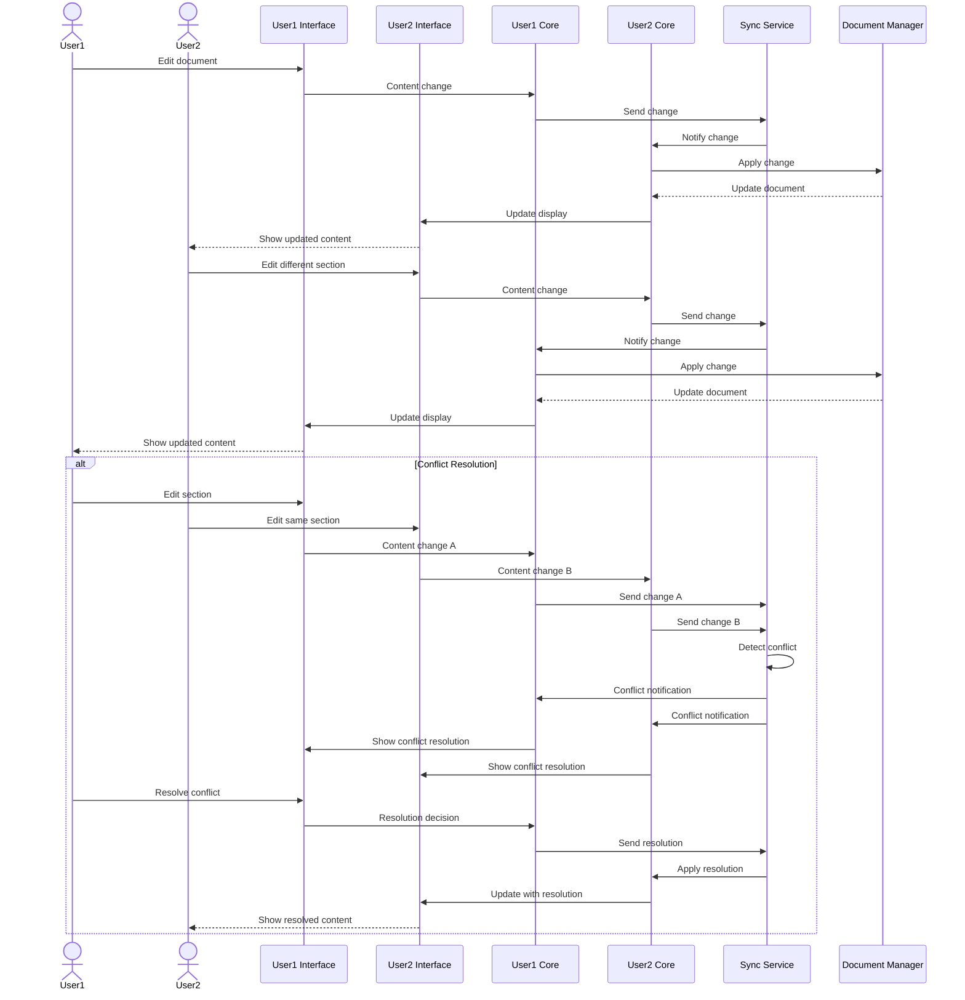
```mermaid
sequenceDiagram
    actor User1
    actor User2
    participant UI1 as User1 Interface
    participant UI2 as User2 Interface
    participant Core1 as User1 Core
    participant Core2 as User2 Core
    participant Sync as Sync Service
    participant DM as Document Manager
    
    User1->>UI1: Edit document
    UI1->>Core1: Content change
    Core1->>Sync: Send change
    
    Sync->>Core2: Notify change
    Core2->>DM: Apply change
    DM-->>Core2: Update document
    Core2->>UI2: Update display
    UI2-->>User2: Show updated content
    
    User2->>UI2: Edit different section
    UI2->>Core2: Content change
    Core2->>Sync: Send change
    
    Sync->>Core1: Notify change
    Core1->>DM: Apply change
    DM-->>Core1: Update document
    Core1->>UI1: Update display
    UI1-->>User1: Show updated content
    
    alt Conflict Resolution
        User1->>UI1: Edit section
        User2->>UI2: Edit same section
        UI1->>Core1: Content change A
        UI2->>Core2: Content change B
        
        Core1->>Sync: Send change A
        Core2->>Sync: Send change B
        
        Sync->>Sync: Detect conflict
        Sync->>Core1: Conflict notification
        Sync->>Core2: Conflict notification
        
        Core1->>UI1: Show conflict resolution
        Core2->>UI2: Show conflict resolution
        
        User1->>UI1: Resolve conflict
        UI1->>Core1: Resolution decision
        Core1->>Sync: Send resolution
        
        Sync->>Core2: Apply resolution
        Core2->>UI2: Update with resolution
        UI2-->>User2: Show resolved content
    end
```

These sequence diagrams illustrate the primary workflows within the MarkDocCompiler application, showing how different components interact to accomplish various tasks. The flows are designed to be modular, maintainable, and extensible, allowing for future enhancements while maintaining a consistent user experience.
