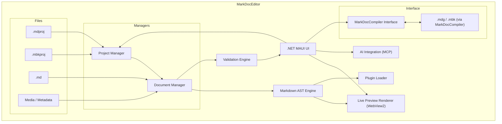

# MarkDocEditor Architecture

MarkDocEditor is a modular .NET MAUI desktop application designed to author structured documentation projects in `.mdproj` and `.mbkproj` formats. 
It integrates a live Markdown editor, preview rendering, project management, and build orchestration via MarkDocCompiler.

---

## Component Overview

---

## Subsystems

### Project Manager

Handles loading, saving, and organizing `.mdproj` and `.mbkproj` files and their dependencies.

### Document Manager

Manages `.md` documents, tracks changes, metadata, and sync with preview.

### Markdown AST Engine

Parses Markdown into an abstract syntax tree via Markdig. Supports plugin and transformation hooks.

### Live Preview Renderer

Uses WebView2 to visualize real-time HTML output generated from the AST.

### Plugin Loader

Loads UI, validation, and render plugins that extend the editor experience.

### Validation Engine

Applies linting rules, structural checks, and schema validation to documents and projects.

### AI Integration

Interfaces with the MCP Protocol to support context-aware AI operations (e.g., summarization, rewriting).

### MarkDocCompiler Interface

Invokes the compiler via CLI or API to transform `.mdproj` → `.mdg` or `.mbkproj` → `.mbk`.

---

This architecture provides a structured, extensible authoring environment backed by a decoupled compilation engine.
