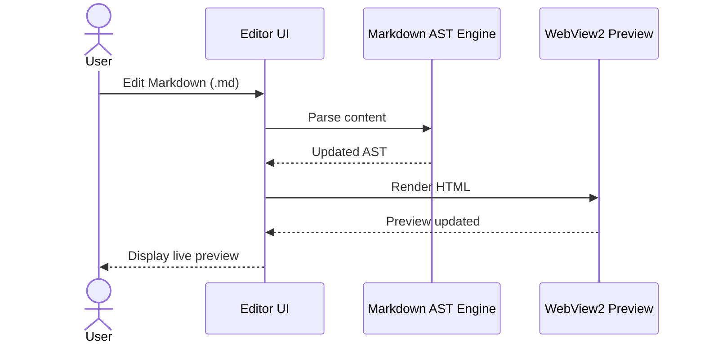
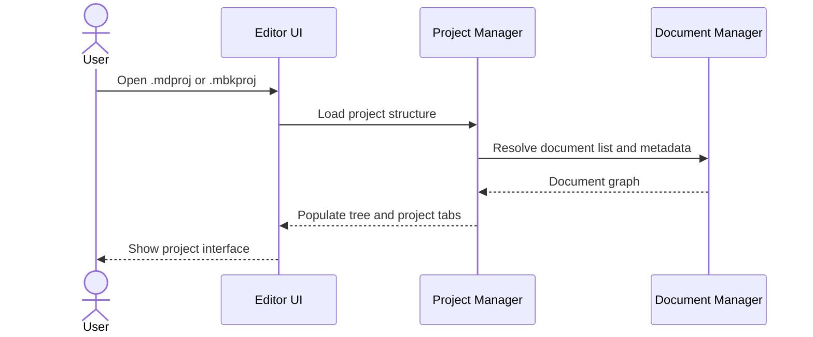
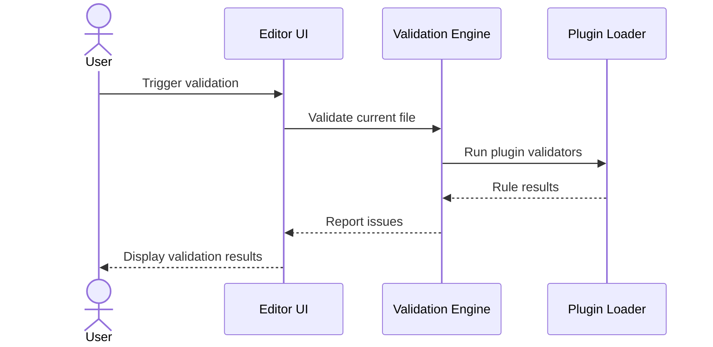
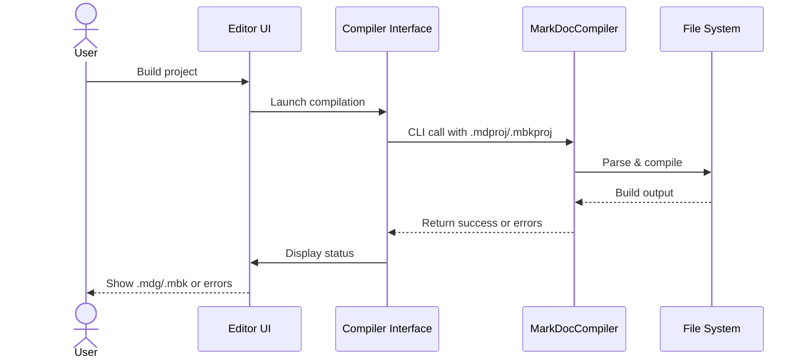
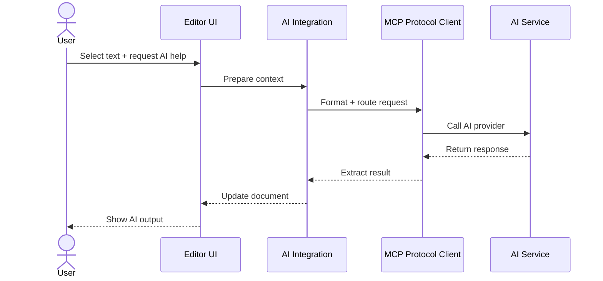

# MarkDocEditor Process and Sequence Flows

This document outlines the interactive and system-driven process flows for MarkDocEditor. These flows capture document editing, live preview, validation, compilation, and plugin operations within the application.

---

## 1. Markdown Editing and Live Preview

---

## 2. Project Load and Navigation

---

## 3. Validation Flow

---

## 4. Compilation Flow

---

## 5. AI Interaction Flow

---

These flows define MarkDocEditor’s core functionality from project creation to build output, allowing for authoring, previewing, validating, and compiling within a single tool.
