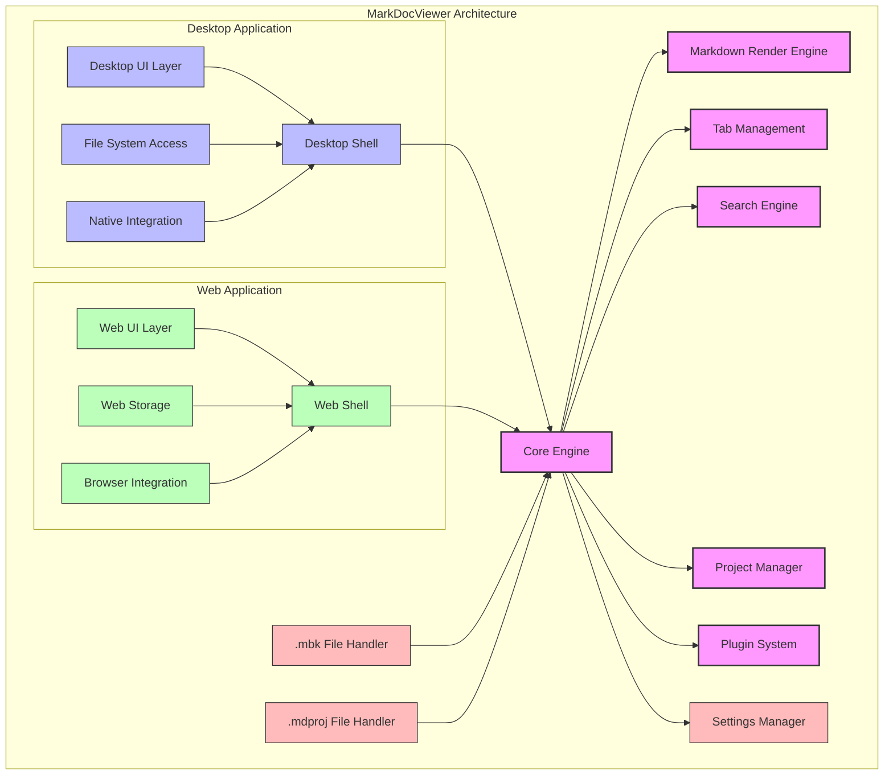
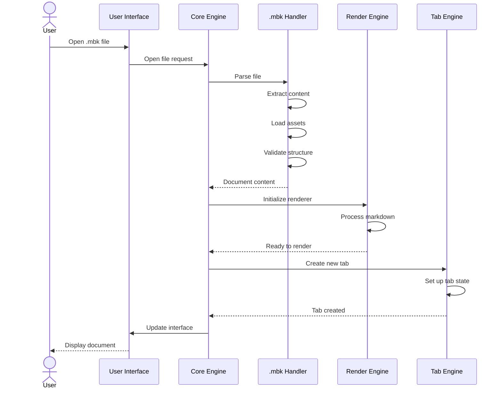
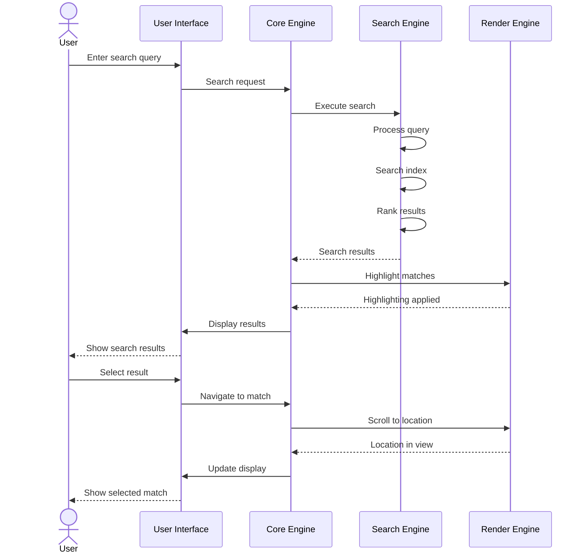
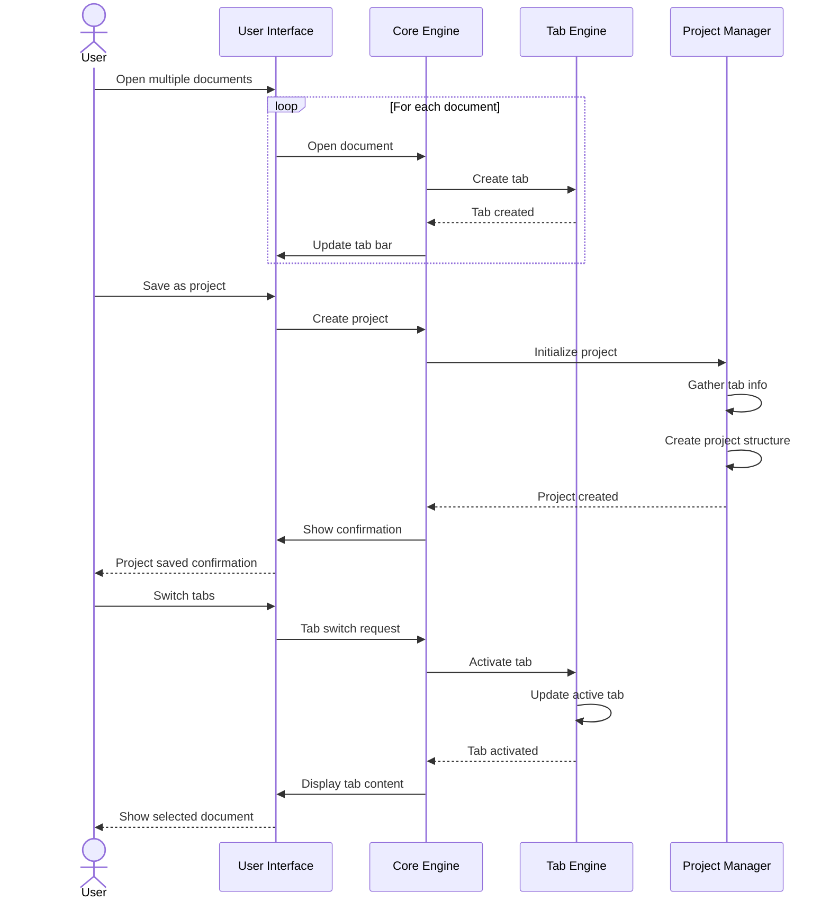

# MarkDocViewer Architecture

## Architectural Overview

MarkDocViewer employs a modular, component-based architecture designed for cross-platform compatibility, performance, and extensibility. The architecture follows a multi-tiered approach with clear separation of concerns between different components.

## Core Components

### Core Engine

The Core Engine serves as the central controller for the viewer application:

- **State Management**: Maintains application and document state
- **Component Coordination**: Orchestrates interaction between components
- **Event System**: Facilitates communication between components
- **Lifecycle Management**: Controls application and document lifecycle
- **Error Handling**: Centralizes error management

### Markdown Render Engine

The Render Engine is responsible for transforming markdown content into visual representation:

- **Direct Rendering**: Renders markdown without HTML conversion
- **Layout Management**: Controls document layout and flow
- **Style Application**: Applies themes and styling
- **Interactive Elements**: Handles expandable sections, tabs, etc.
- **Media Rendering**: Displays images, audio, video, and other media

### Tab Management

The Tab Engine handles multiple open documents:

- **Tab Creation/Deletion**: Manages document tabs
- **Tab State**: Tracks tab properties and state
- **Tab Navigation**: Facilitates movement between tabs
- **Tab History**: Maintains navigation history per tab
- **Tab Groups**: Organizes tabs into logical groups

### Search Engine

The Search Engine provides content discovery capabilities:

- **Indexing**: Creates and maintains search indices
- **Query Processing**: Parses and executes search queries
- **Result Ranking**: Prioritizes and ranks search results
- **Highlighting**: Identifies and highlights match locations
- **Filtering**: Narrows search by various criteria

### Project Manager

The Project Manager handles collections of documents:

- **.mdproj Handling**: Opens and manages project files
- **Workspace Management**: Maintains user workspaces
- **State Persistence**: Saves and restores project state
- **Document Relationships**: Manages links between documents
- **Organization Tools**: Provides structure for document collections

### Plugin System

The Plugin System enables extensibility:

- **Plugin Loading**: Discovers and initializes plugins
- **Extension Points**: Provides hooks for customization
- **Lifecycle Management**: Controls plugin activation/deactivation
- **Isolation**: Ensures security and stability
- **Configuration**: Manages plugin settings

## Platform-Specific Components

### Desktop Application

- **Desktop Shell**: Native application container
- **Desktop UI Layer**: Platform-appropriate user interface
- **File System Access**: Direct file system interaction
- **Native Integration**: Integration with operating system
- **System Notifications**: OS-level notifications and alerts

### Web Application

- **Web Shell**: Browser-based container
- **Web UI Layer**: Responsive web interface
- **Web Storage**: Browser storage mechanisms
- **Browser Integration**: Integration with browser features
- **Progressive Features**: Offline capabilities and PWA support

## External Components

### .mbk File Handler

Manages the core documentation format:

- **Parsing**: Extracts content from .mbk files
- **Validation**: Verifies file integrity
- **Asset Management**: Handles embedded resources
- **Metadata Extraction**: Retrieves document metadata
- **Caching**: Optimizes access to content

### .mdproj File Handler

Manages project files:

- **Project Structure**: Maintains document relationships
- **Reference Resolution**: Resolves document references
- **State Management**: Tracks project state
- **Metadata Handling**: Manages project metadata
- **Persistence**: Saves and loads project state

### Settings Manager

Handles user preferences and configuration:

- **Preference Storage**: Persists user settings
- **Default Management**: Provides sensible defaults
- **Validation**: Ensures setting validity
- **Migration**: Handles setting changes between versions
- **Sync**: Optional synchronization of settings

## Data Flow

### Document Opening Flow

### Search Process

### Tab Management Flow

## Component Interaction

### Core Engine and Render Engine

The Core Engine communicates with the Render Engine to transform markdown content into visual representation:

1. Core Engine provides document content to Render Engine
2. Render Engine processes content and creates visual elements
3. Core Engine manages render state and coordinates updates
4. Render Engine notifies Core Engine of user interactions
5. Core Engine coordinates responses to these interactions

### Tab Engine and Project Manager

The Tab Engine works with the Project Manager to handle collections of documents:

1. Tab Engine maintains the state of open documents
2. Project Manager provides structure for document collections
3. Tab Engine notifies Project Manager of tab changes
4. Project Manager updates project state based on tab changes
5. Both components coordinate with Core Engine for user interactions

### Search Engine and Render Engine

The Search Engine and Render Engine collaborate to find and display content:

1. Search Engine indexes document content for efficient searching
2. Render Engine displays document content visually
3. Search Engine provides match locations to Render Engine
4. Render Engine highlights matches in the visual representation
5. Both components coordinate with Core Engine for user navigation

## Technical Architecture

### Shared Core and Platform-Specific Shells

The architecture follows a core + shell pattern:

1. **Shared Core**: Platform-agnostic components for core functionality
2. **Platform Shells**: Platform-specific implementations for UI and system integration
3. **Bridge Layer**: Abstraction layer between core and platform-specific code
4. **Component Registry**: Dynamic registration of components based on platform
5. **Feature Detection**: Runtime adaptation to platform capabilities

### Cross-Platform Strategy

The cross-platform approach balances consistency and native feel:

1. **Core Business Logic**: Shared across all platforms
2. **UI Presentation**: Platform-appropriate implementation
3. **Feature Parity**: Consistent capabilities with platform-appropriate interactions
4. **Performance Optimization**: Platform-specific optimizations where needed
5. **Deployment Strategy**: Platform-appropriate packaging and distribution

### Code Sharing

Code sharing is maximized while respecting platform differences:

1. **Core Logic**: Shared TypeScript/JavaScript for business logic
2. **UI Components**: Platform-specific implementations with shared patterns
3. **Data Models**: Common structures across platforms
4. **Testing**: Cross-platform test suite with platform-specific extensions
5. **Build System**: Unified build pipeline with platform-specific targets

## Extension Points

MarkDocViewer provides several extension points for customization:

1. **Content Renderers**: Custom rendering for specific content types
2. **UI Components**: Additional interface elements
3. **Search Providers**: Alternative search implementations
4. **Storage Mechanisms**: Custom storage solutions
5. **Theme Providers**: Custom visual themes
6. **Integration Points**: Connections to external systems

## Security Architecture

Security is built into the architecture:

1. **Content Isolation**: Strict separation between content and application code
2. **Plugin Sandboxing**: Isolation of third-party extensions
3. **Input Validation**: Thorough validation of all external inputs
4. **Permission Model**: Explicit permissions for sensitive operations
5. **Update Security**: Secure mechanism for software updates

## Performance Considerations

Several strategies ensure optimal performance:

1. **Virtualized Rendering**: Only render visible content
2. **Incremental Search**: Efficient search algorithms for large documents
3. **Asset Optimization**: Intelligent loading and caching of resources
4. **Memory Management**: Careful resource usage for large documents
5. **Background Processing**: Offload intensive operations to background threads

## Deployment Architecture

MarkDocViewer can be deployed in several configurations:

1. **Standalone Desktop Application**: Traditional desktop application
2. **Hosted Web Application**: Server-hosted web viewer
3. **Progressive Web App**: Installable browser-based application
4. **Embedded Viewer**: Integration into other applications
5. **Custom Deployment**: Specialized configurations for specific needs

## Synchronization Architecture

Optional synchronization capabilities are built into the architecture:

1. **State Synchronization**: Reading position, bookmarks, annotations
2. **Content Synchronization**: Optional local caching of remote content
3. **Settings Synchronization**: User preferences across devices
4. **Conflict Resolution**: Handling of conflicting changes
5. **Offline Support**: Full functionality without connectivity

## Future Extensibility

The architecture allows for future expansion in several areas:

1. **Mobile Applications**: Native iOS and Android viewers
2. **Collaboration Features**: Multi-user interactions
3. **Enhanced Annotation**: Rich annotation capabilities
4. **Integration Ecosystem**: Broader integration options
5. **Embedded Solutions**: Viewer components for third-party applications

This modular architecture ensures that MarkDocViewer can evolve to meet future documentation needs while maintaining its core strengths in simplicity, performance, and flexibility.
