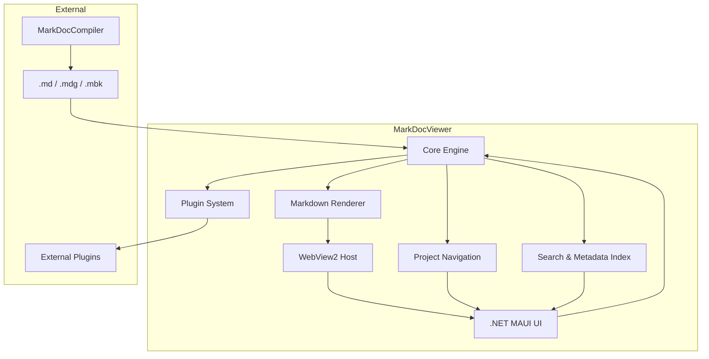

# MarkDocViewer Architecture

MarkDocViewer is a modular .NET MAUI desktop application designed for high-performance viewing of Markdown-based documentation. Its architecture emphasizes rendering precision, plugin extensibility, and seamless compatibility with `.md`, `.mdg`, and `.mbk` formats.

---

## Component Overview

---

## Core Components

### Core Engine

Handles document routing, plugin registration, data context, and state flow.

### UI Layer

Implemented in .NET MAUI with XAML for native cross-platform styling and layout.

### Renderer

Uses Markdig to convert Markdown to AST → HTML. Embeds rendering in WebView2 and injects MathJax, Mermaid, or other plugin content.

### Viewer (WebView2 Host)

Renders HTML output within a Chromium-based sandbox for secure visualization.

### Project Navigation

Manages the table of contents and navigation for `.mdg` and `.mbk` formats.

### Indexer

Provides in-document search, indexing of headings and metadata.

### Plugin System

Supports custom C# plugins that extend rendering or embed components.

---

## External Interfaces

* **Supported Formats**: `.md`, `.mdg`, `.mbk`
* **Compiler Input**: Consumes `.mdg` and `.mbk` files produced by MarkDocCompiler
* **Shared Plugins**: Compatible with the same plugin architecture used across MarkDocSuite

---

This architecture enables lightweight, secure, and extendable Markdown rendering for the entire suite.
