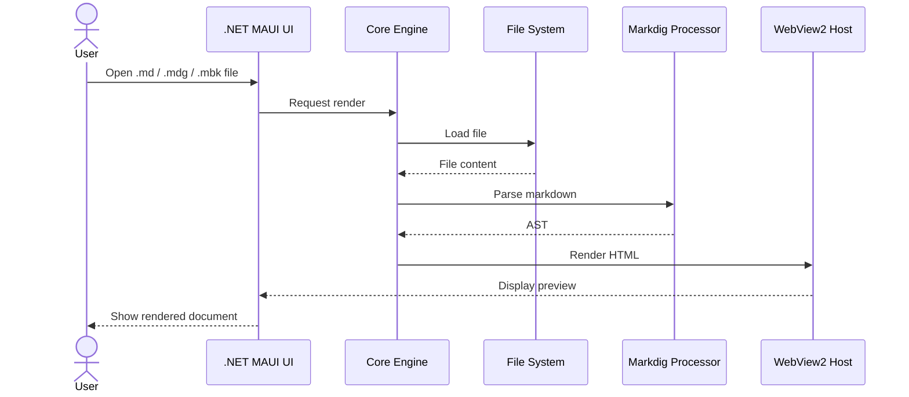
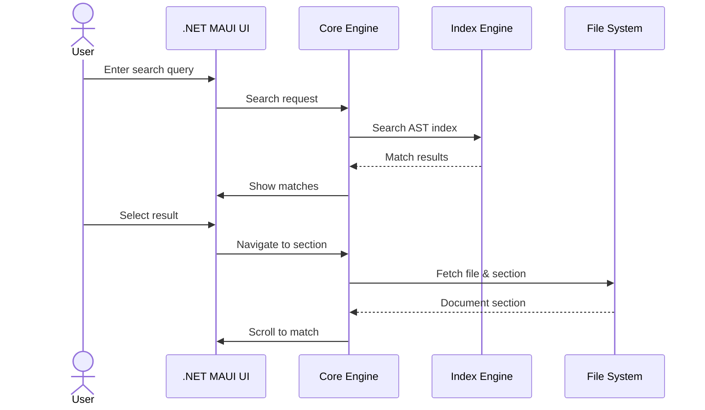
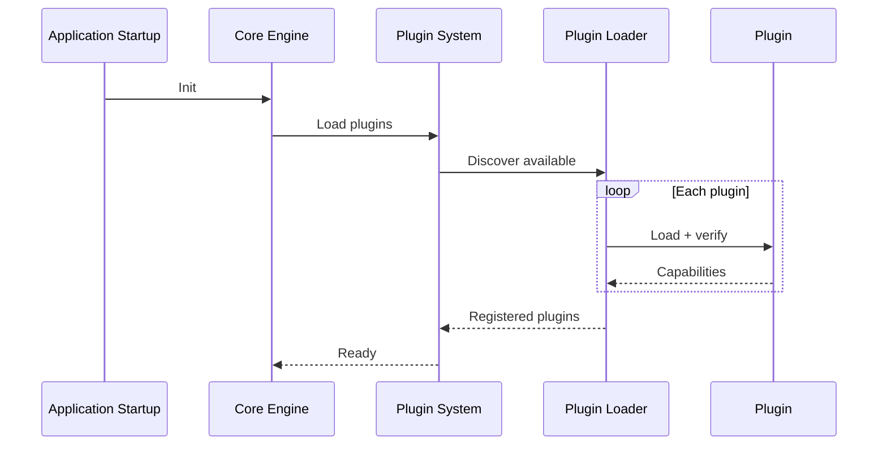
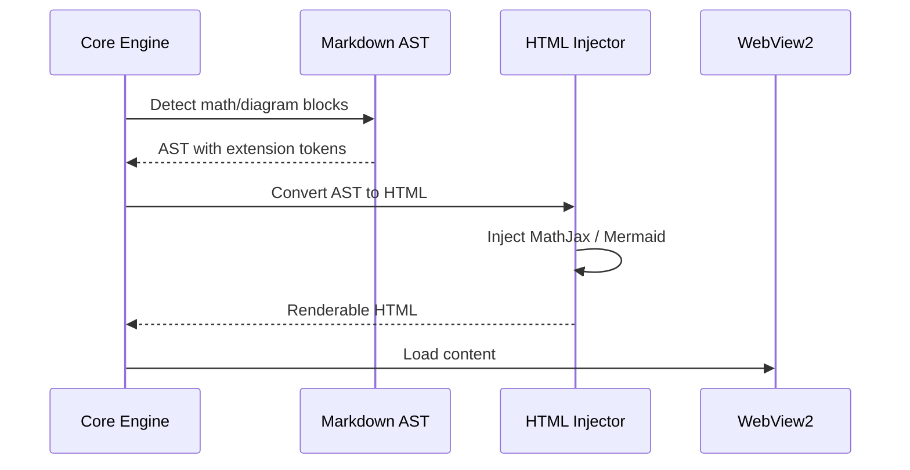
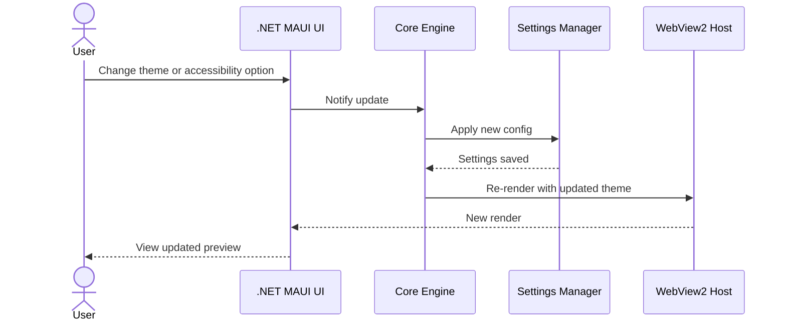

# MarkDocViewer Process and Sequence Flows

This document outlines the core interaction and rendering flows of the MarkDocViewer application. All diagrams reflect the current implementation using .NET MAUI, Markdig, WebView2, and the shared MarkDocSuite plugin system.

---

## 1. File Opening and Rendering Flow

---

## 2. Navigation and Search Flow

---

## 3. Plugin Bootstrapping Flow

---

## 4. Math and Diagram Injection Flow

---

## 5. Theme and Accessibility Update Flow

---

These flows represent the end-to-end behavior of the MarkDocViewer application for viewing, navigating, rendering, and customizing Markdown-based documentation.
