# MarkDocViewer Process and Sequence Flows

This document outlines the key process and sequence flows within the MarkDocViewer application, illustrating how different components interact to accomplish core tasks.

## Document Loading Flow

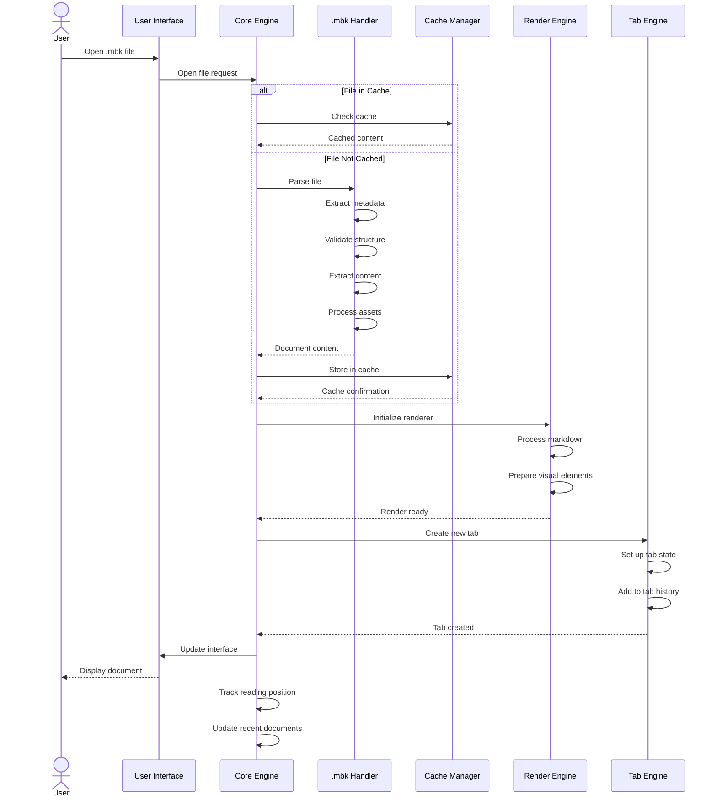

## Navigation Flow

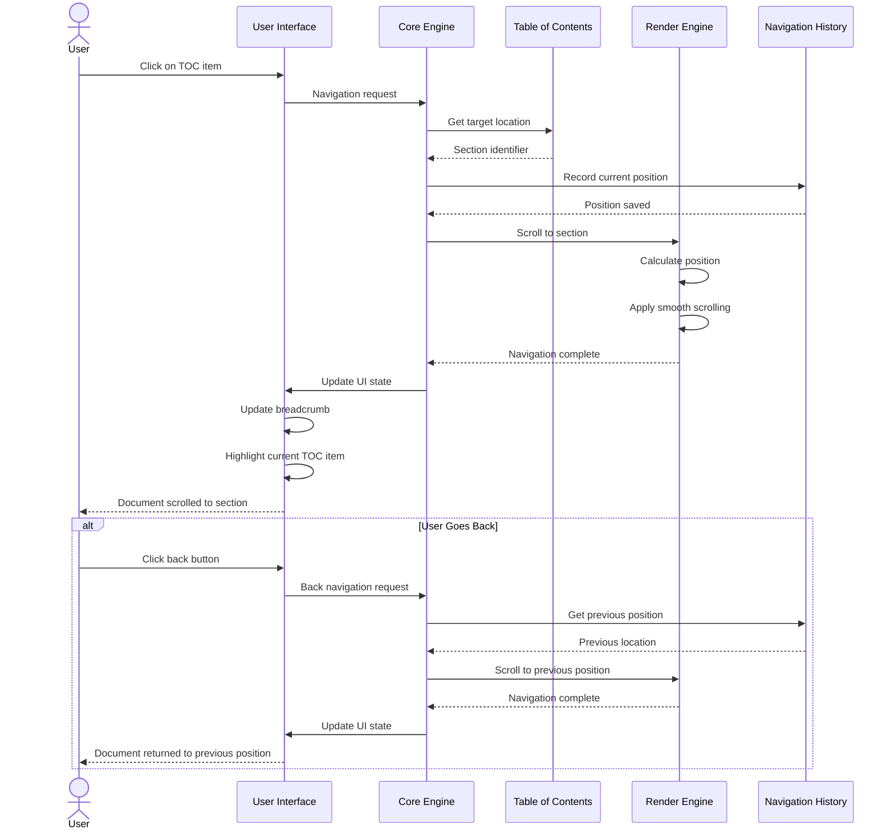

## Tab Management Flow

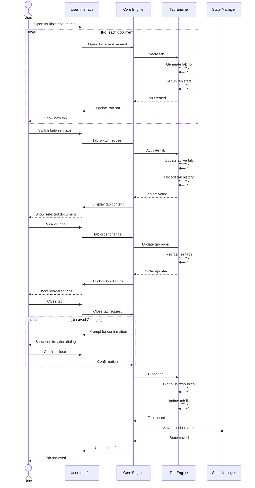

## Project Management Flow

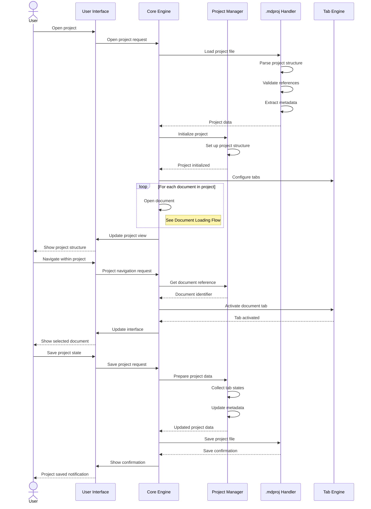

## Search Process Flow

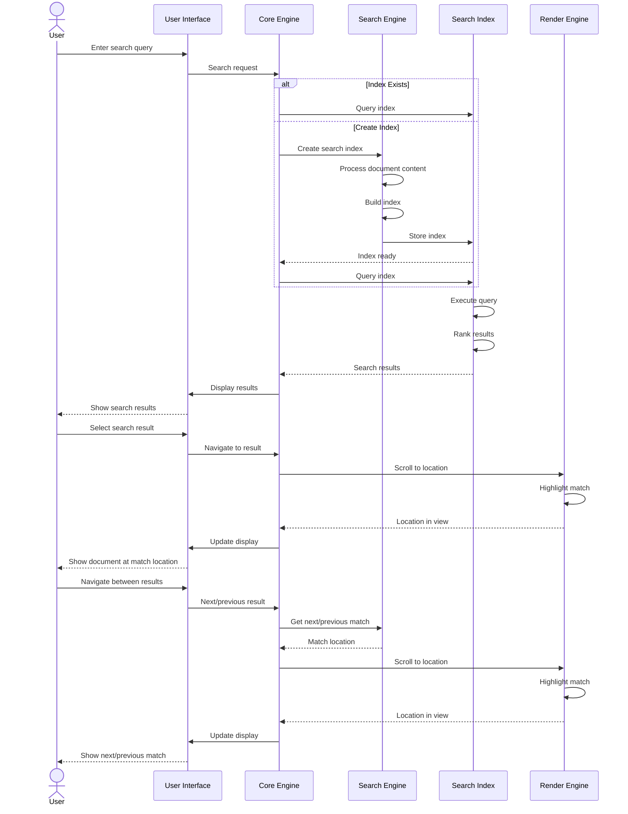

## Annotation Flow

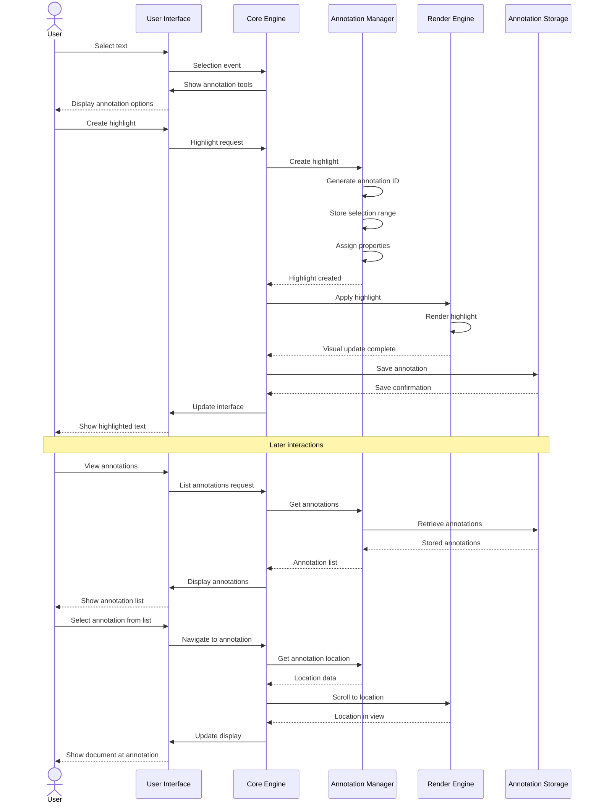

## Theme Change Flow

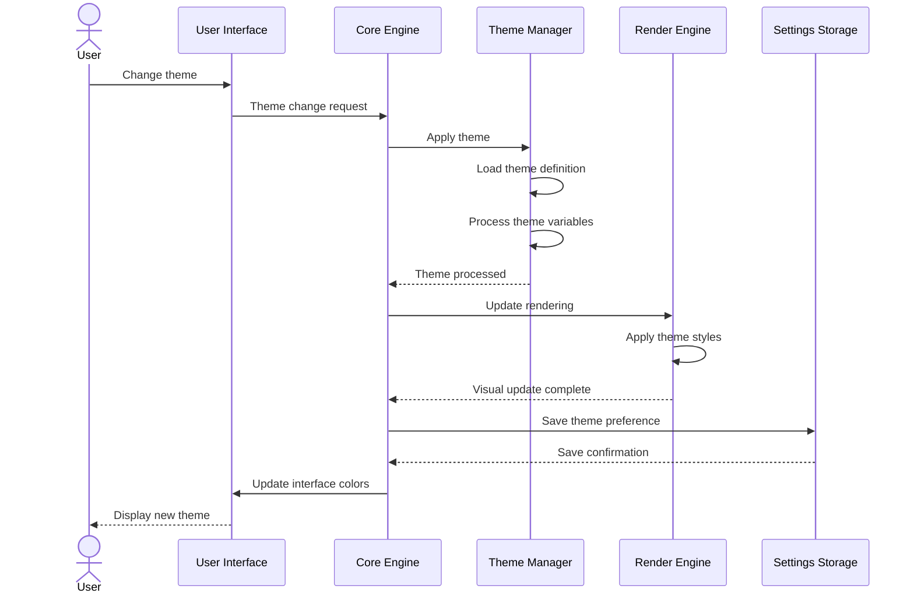

## Offline Sync Flow

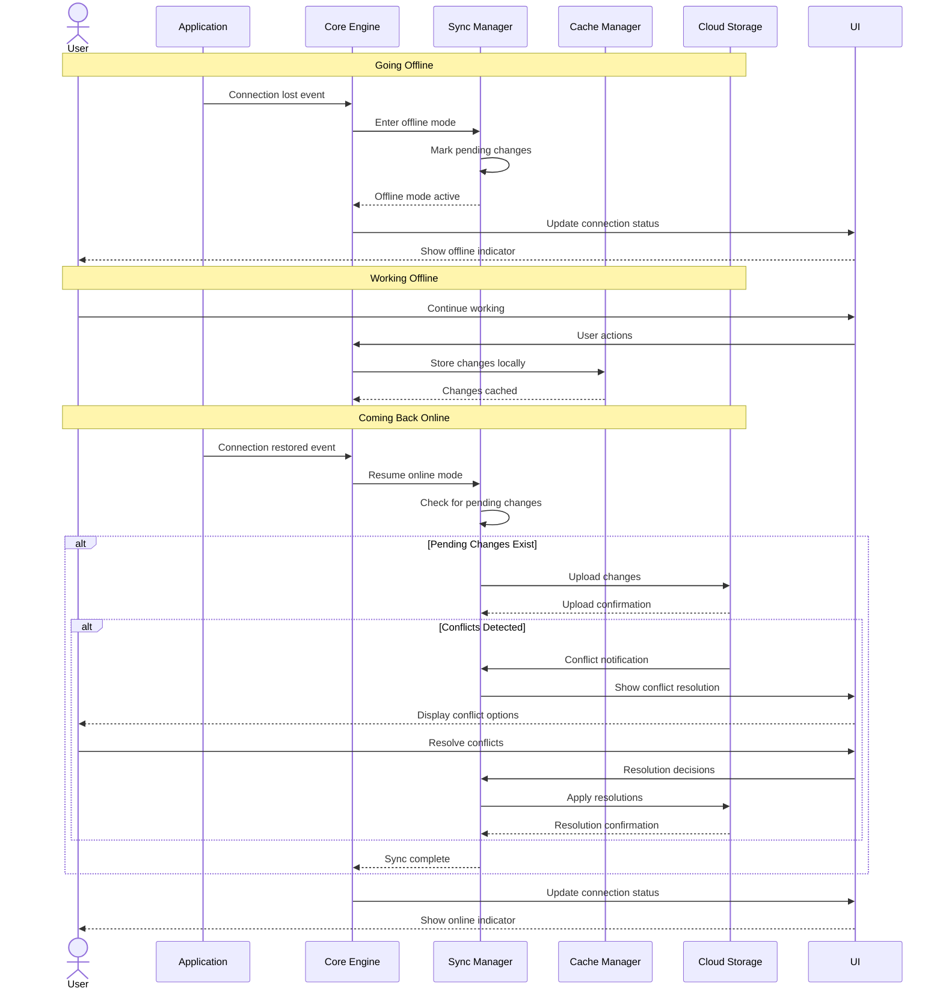

## Print/Export Flow

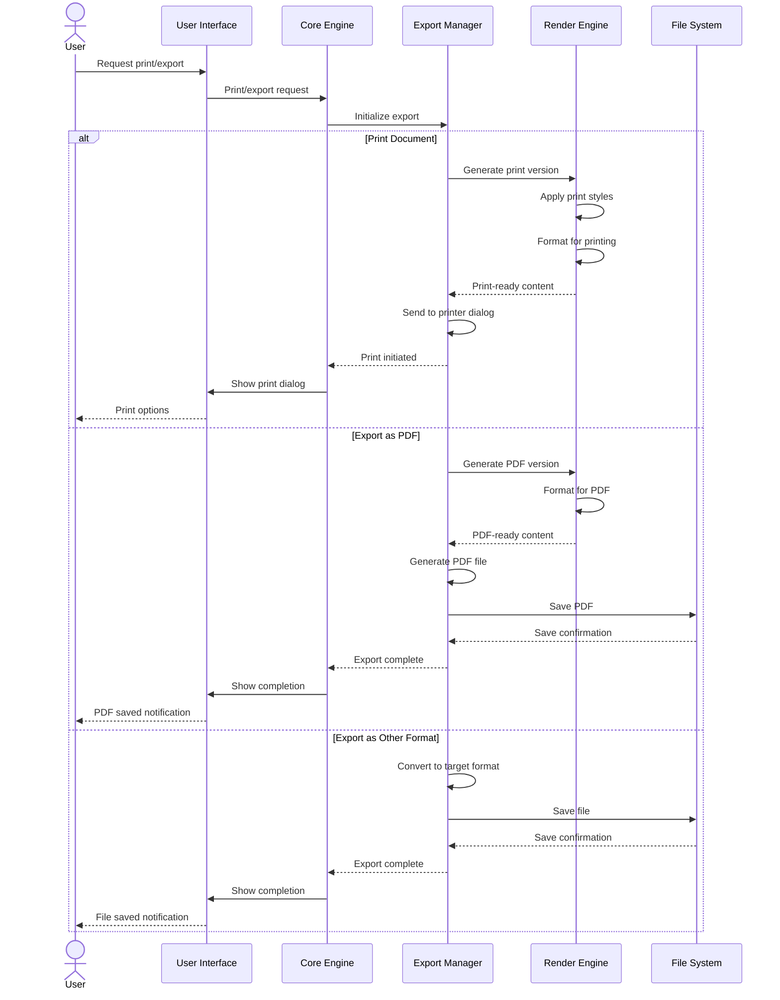

## Plugin Loading Flow

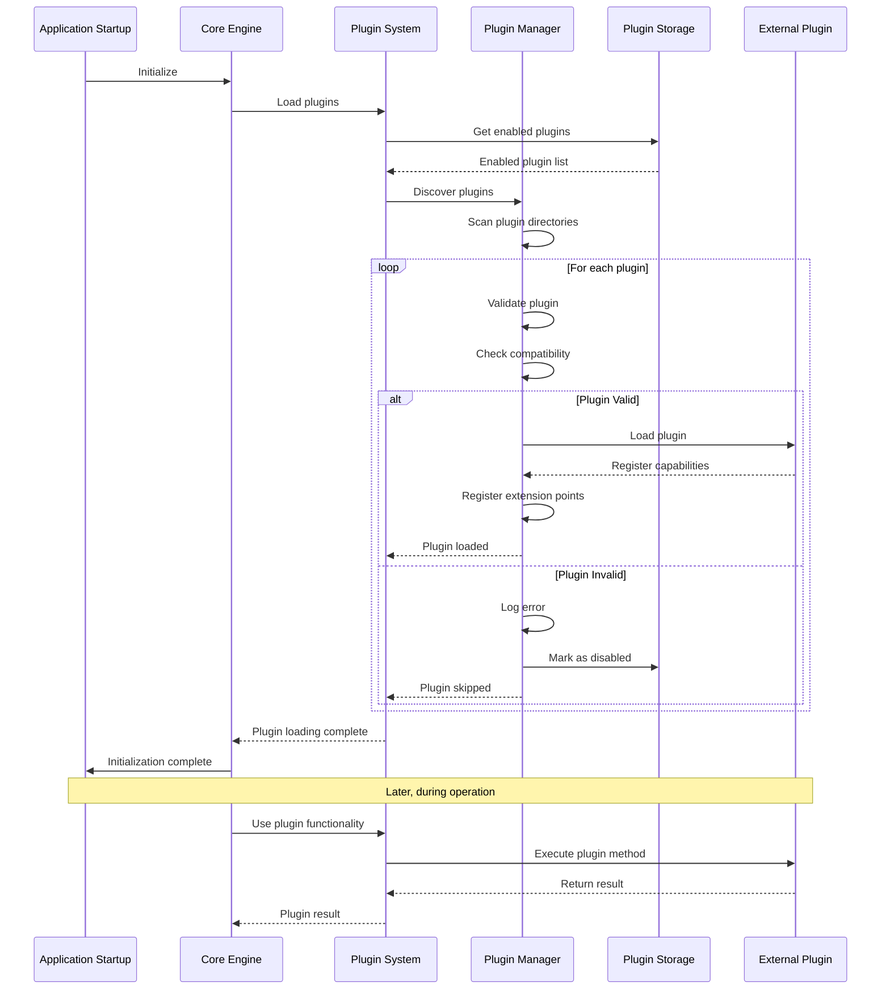

## Tab Group Management Flow

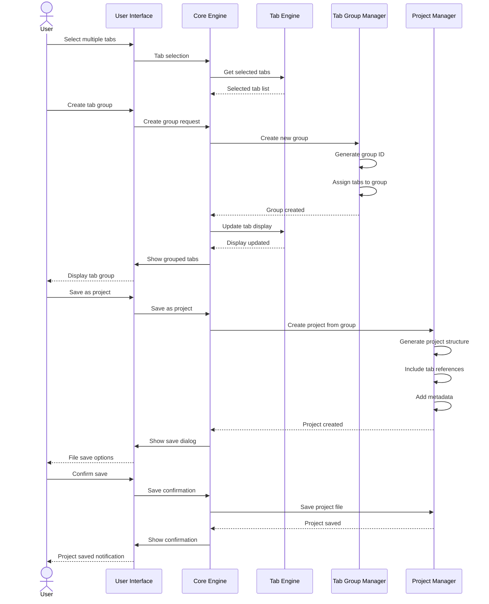

## Settings Management Flow

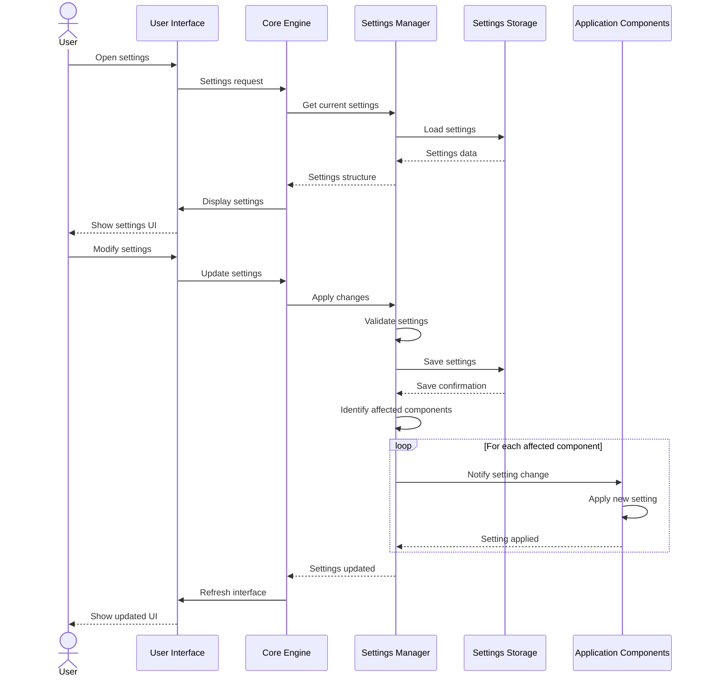

These sequence diagrams illustrate the primary workflows within the MarkDocViewer application, showing how different components interact to accomplish various tasks. The flows are designed to be modular, maintainable, and extensible, allowing for future enhancements while maintaining a consistent user experience across all platforms.
