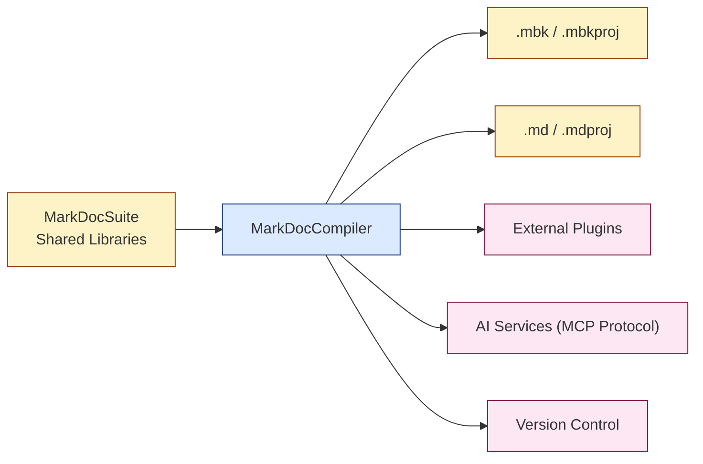
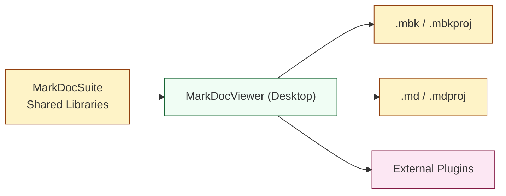
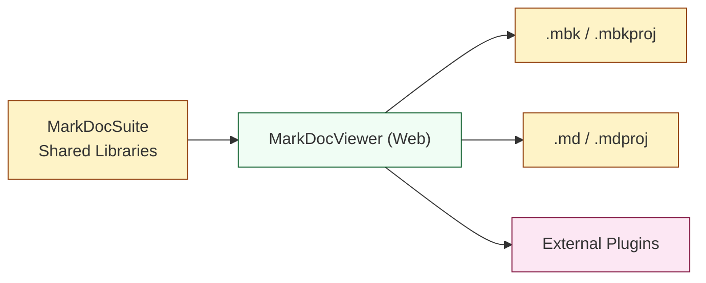
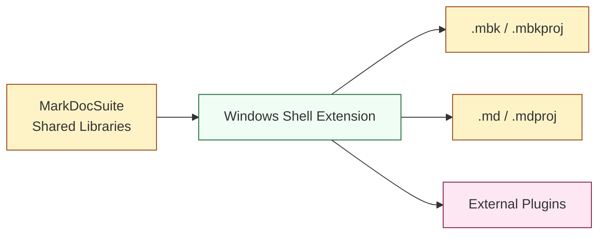

# MarkDocSuite System Architecture

## Architectural Overview

MarkDocSuite uses a modular, component-based architecture designed for extensibility, performance, and cross-platform compatibility. The system architecture follows industry best practices for separation of concerns, well-defined interfaces, and shared components to maximize code reuse between applications.

## 📦 MarkDocCompiler   

### Simpleified Overview

## 🖥️ MarkDocViewer (Desktop)   

### Simpleified Overview

## 🌐 MarkDocViewer (Web)   

### Simpleified Overview

## 🪟 Windows Shell Extension   

### Simpleified Overview

## Architectural Principles

The MarkDocSuite architecture adheres to the following principles:

1. **Separation of Concerns**: Each component has a single responsibility and well-defined interfaces
2. **Code Reuse**: Common functionality is shared between applications through libraries
3. **Extensibility**: Plugin systems enable customization without modifying core code
4. **Cross-Platform Compatibility**: Core components designed to work on multiple platforms
5. **Performance Focus**: Direct rendering of markdown content without intermediate HTML conversion
6. **Security First**: Sandbox design for plugins and content isolation

## Core Components

### Shared Libraries

These components are shared across the MarkDocCompiler and MarkDocViewer applications:

1. **Markdown Processing Library**
   - Parser for markdown content
   - Abstract Syntax Tree (AST) representation
   - Extensible syntax support
   - Common transformation utilities

2. **File Format Utilities**
   - Implementations of .mbk and .mdproj formats
   - Compression/decompression utilities
   - File structure management
   - Metadata handling

3. **Plugin Interfaces**
   - Interface definitions for all plugin types
   - Plugin loading and lifecycle management
   - Plugin discovery mechanisms
   - Version compatibility checking

4. **UI Component Library**
   - Shared UI elements used across applications
   - Theme management
   - Responsive layout components
   - Accessibility support

5. **MCP Protocol Client**
   - Implementation of Model Control Protocol
   - Authentication and key management
   - Request/response handling
   - Streaming support

### MarkDocCompiler Components

1. **Core Compiler Engine**
   - Orchestrates the compilation process
   - Manages workflow between components
   - Handles error and exception cases
   - Provides progress reporting

2. **Markdown Processing Pipeline**
   - Multi-stage content processing
   - Syntax validation
   - Link checking
   - Structure analysis

3. **Package Generator**
   - Creates .mbk and .mdproj files
   - Handles asset inclusion
   - Manages metadata
   - Optimizes file size

4. **Plugin System**
   - Manages compiler-specific plugins
   - Provides plugin hooks during compilation
   - Handles plugin configuration

5. **User Interface**
   - Editor environment
   - Preview capabilities
   - Project management interface
   - Configuration UI

6. **AI Integration Layer**
   - Connects to AI services via MCP
   - Provides content enhancement features
   - Manages AI-assisted workflows

### MarkDocViewer Components

1. **Desktop/Web Core**
   - Central management for viewer functionality
   - Handles file loading and processing
   - Manages application state
   - Coordinates between components

2. **Tab Management**
   - Handles multiple open documents
   - Manages tab state and history
   - Provides tab navigation
   - Supports tab groups

3. **Markdown Render Engine**
   - Renders markdown content directly
   - Handles visual styling
   - Supports interactive elements
   - Provides printing capabilities

4. **Plugin System**
   - Manages viewer-specific plugins
   - Provides rendering extension points
   - Handles viewer plugin configuration

5. **User Interface**
   - Document viewing interface
   - Navigation controls
   - Search interface
   - Settings and preferences

6. **Project Manager**
   - Handles .mdproj files
   - Manages collections of documents
   - Provides project organization features

## External Integrations

### AI Services
- Connection to AI providers via MCP protocol
- Support for OpenAI, Anthropic, and other models
- Configurable API endpoints and keys

### Version Control Systems
- Git integration for content tracking
- Support for other VCS systems
- Commit and history visualization

### External Plugins
- Ecosystem of third-party extensions
- Marketplace for plugin discovery
- Plugin security and validation

## Data Flow

### Compilation Process
1. Markdown content is authored or imported
2. Content passes through processing pipeline
3. Plugins apply transformations
4. Validation checks identify issues
5. Package generator creates .mbk file
6. Optional project creation for document collections

### Viewing Process
1. User opens .mbk or .mdproj file
2. File is validated and loaded
3. Content is processed by render engine
4. UI displays rendered content
5. User navigates and interacts with content
6. State changes are tracked for persistence

## Security Considerations

The architecture incorporates several security measures:

1. **Plugin Sandboxing**: Plugins run in isolated environments
2. **Content Isolation**: Strict separation between content and application code
3. **Input Validation**: All external content is validated before processing
4. **Permission Management**: Explicit user permissions for external resources
5. **Update Mechanism**: Secure update process for all components

## Scalability and Performance

The architecture is designed for performance and scalability:

1. **Efficient Parsing**: Optimized markdown parsing algorithms
2. **Incremental Updates**: Only changed content is reprocessed
3. **Lazy Loading**: Content is loaded on demand for large documents
4. **Resource Management**: Careful handling of memory and system resources
5. **Caching**: Strategic caching of processed content

## Future Extensibility

The architecture allows for future expansion in several areas:

1. **Additional Viewers**: Mobile platforms, embedded viewers
2. **Cloud Integration**: Synchronization and sharing
3. **Collaboration Features**: Real-time editing and comments
4. **Enhanced AI Capabilities**: More sophisticated AI assistance
5. **Enterprise Features**: Advanced security and management

This system architecture provides a solid foundation for the MarkDocSuite, enabling the creation of a powerful, flexible, and user-friendly documentation system that meets the needs of diverse users across multiple platforms.
