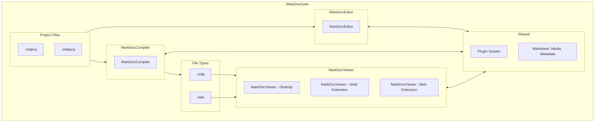

# MarkDocSuite System Architecture

The MarkDocSuite platform is composed of three modular applications: MarkDocEditor, MarkDocCompiler, and MarkDocViewer. These components communicate through file-based integration and a shared plugin architecture.

---

## Architecture Overview

---

## Key Design Principles

* **Separation of Concerns**: Each application handles a distinct part of the documentation lifecycle: authoring, building, and viewing.
* **Interoperability via Files**: All components communicate using well-defined file formats (`.mdproj`, `.mbkproj`, `.mdg`, `.mbk`).
* **Shared Extensibility**: A unified plugin system allows plugins to be reused across Editor, Compiler, and Viewer.
* **Cross-Platform Delivery**: All components are built on .NET 8 and .NET MAUI to run on Windows/macOS.

---

This architecture ensures that MarkDocSuite can scale across user roles, workflows, and platforms while maintaining consistency, performance, and modularity.
